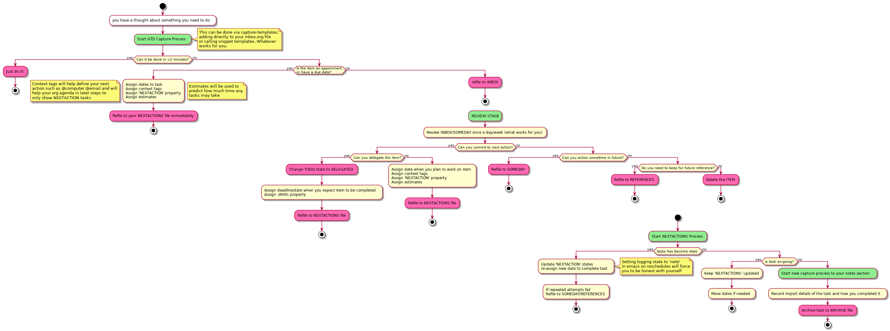

# Table of Contents

-   [Getting started](#orgf65e7cf)
-   [General Settings](#org2c89275)
    -   [Lines](#orgb4ed63b)
    -   [Keys](#orge0a7cc2)
    -   [General settings](#org503280e)
    -   [Popup Rules](#org9863923)
-   [Doom Settings](#orgd4ad36a)
    -   [Fonts](#org360c363)
    -   [Mode line](#orge76f7a2)
    -   [Theme](#orga15aac3)
-   [Org Mode Settings](#org3c01be3)
    -   [Agenda](#org023e010)
    -   [Load all \*.org files to agenda](#orgf93f406)
    -   [Captures](#org28b39a4)
        -   [Getting Things Done](#orgf8ab4bd)
            -   [Recurring Tasks](#orgd36a142)
            -   [Project](#org9249cfb)
            -   [New Capture](#org01d6a5f)
        -   [Reference - Yank Example](#orgdb40ca9)
        -   [Reference - New Entry](#org80d507a)
        -   [Diary - Daily Log](#orgcfff052)
    -   [Directories](#orgc1ccd52)
    -   [Exports](#org8d54673)
    -   [Faces](#orgaaa7ac9)
    -   [Keywords](#org8e1fc3e)
    -   [Latex Exports](#orgfdc88d3)
    -   [Link Abbreviations](#org733788f)
    -   [Logging & Drawers](#org7360fa1)
    -   [Pitch Settings](#orgd650ef2)
    -   [Prettify](#orgc38fb14)
    -   [Publishing](#org8e3888a)
    -   [Refiling](#orgaa2bd91)
    -   [Startup](#orge852956)
    -   [Tags](#org6a77a49)
-   [Extra Modules](#org344c232)
    -   [Plantuml](#org39e90fe)
    -   [Org-Mind-Map](#orgccfb554)
    -   [Gnuplot](#org189ba8f)
    -   [Deft](#orgd457aa8)
    -   [Elfeed](#orgcfe8390)
    -   [Org-Clock-Switch](#org8e0efde)
    -   [Org-Rifle](#orgac89396)
    -   [Update Tickboxes](#org653f421)
    -   [Zyrohex/org-tasks-refile](#orgad7cd4a)
    -   [Zyrohex/org-reference-refile](#org191c596)
    -   [Zyrohex/org-notes-refile](#org370c74b)
    -   [WSL Browser](#org248453c)
-   [Super Agenda Groups](#orgf403740)

My DOOM emacs private configuration:

High focus on GTD process workflow: ([source](https://github.com/nmartin84/.references/blob/master/gtd-babel.org))

# Getting started

If you have not installed DOOM Emacs but would like to:

    git clone https://github.com/nmartin84/.doom.d.git ~/.doom.d
    git clone https://github.com/hlissner/doom-emacs ~/.emacs.d
    ~/.emacs.d/bin/doom install

Otherwise, backup your existing DOOM private config and run:

    mv ~/.doom.d ~/.doom.d_backup
    git clone https://github.com/nmartin84/.doom.d.git ~/.doom.d
    ~/.emacs.d/bin/doom refresh

This repo uses a literate configuration, with basic settings in `./init.el`, `./packags.el`, the content of `./config.el` will be generated
from the Emacs Lisp code blocks in `config.org`. This readme file gets created when exporting `config.org` to markdown.

# General Settings

## Lines

For this we just make small tweaks to line numbers.

    (setq display-line-numbers t)

## Keys

    (bind-key "C-<down>" #'+org/insert-item-below)
    (map!
     :nvime "<f5> d" #'helm-org-rifle-directories
     :nvime "<f5> b" #'helm-org-rifle-current-buffer
     :nvime "<f5> o" #'helm-org-rifle-org-directory
     :nvime "<f5> a" #'helm-org-rifle-agenda-files)
    
    (map! :leader
          :n "e" #'ace-window
          :n "!" #'swiper
          :n "@" #'swiper-all
          :n "#" #'deadgrep
          :n "$" #'helm-org-rifle-directories
          :n "X" #'org-capture
          (:prefix "o"
            :n "e" #'elfeed
            :n "g" #'metrics-tracker-graph
            :n "o" #'org-open-at-point
            :n "u" #'elfeed-update
            :n "w" #'deft)
          (:prefix "f"
            :n "o" #'plain-org-wiki-helm)
          (:prefix "n"
            :n "D" #'dictionary-lookup-definition
            :n "T" #'powerthesaurus-lookup-word)
          (:prefix "s"
            :n "d" #'deadgrep
            :n "q" #'org-ql-search
            :n "b" #'helm-org-rifle-current-buffer
            :n "o" #'helm-org-rifle-org-directory
            :n "." #'helm-org-rifle-directories)
          (:prefix "b"
            :n "c" #'org-board-new
            :n "e" #'org-board-open)
          (:prefix "t"
            :n "s" #'org-narrow-to-subtree
            :n "w" #'widen)
          (:prefix "/"
            :n "j" #'org-journal-search))

## General settings

    (setq-default fill-column 80)
    (setq diary-file "~/.org/gtd/diary.org")
    (global-auto-revert-mode t)

## Popup Rules

    (after! org (set-popup-rule! "^Capture.*\\.org$" :side 'right :size .40 :select t :vslot 2 :ttl 3))
    (after! org (set-popup-rule! "Dictionary" :side 'bottom :height .40 :width 20 :select t :vslot 3 :ttl 3))
    (after! org (set-popup-rule! "*helm*" :side 'bottom :height .40 :select t :vslot 5 :ttl 3))
    (after! org (set-popup-rule! "*deadgrep" :side 'bottom :height .40 :select t :vslot 4 :ttl 3))
    (after! org (set-popup-rule! "*xwidget" :side 'right :size .40 :select t :vslot 5 :ttl 3))
    (after! org (set-popup-rule! "*org agenda*" :side 'right :size .40 :select t :vslot 2 :ttl 3))

# Doom Settings

## Fonts

For fonts please download [Input](https://input.fontbureau.com/download/) and [DejaVu](http://sourceforge.net/projects/dejavu/files/dejavu/2.37/dejavu-fonts-ttf-2.37.tar.bz2)

    (setq doom-font (font-spec :family "InputMono" :size 16)
          doom-variable-pitch-font (font-spec :family "InputMono" :height 120)
          doom-unicode-font (font-spec :family "DejaVu Sans")
          doom-big-font (font-spec :family "InputMono" :size 18))
    (prefer-coding-system       'utf-8)
    (set-default-coding-systems 'utf-8)
    (set-terminal-coding-system 'utf-8)
    (set-keyboard-coding-system 'utf-8)
    (setq default-buffer-file-coding-system 'utf-8)

## Mode line

    (setq doom-modeline-gnus t
          doom-modeline-gnus-timer 'nil)

## Theme

    (setq doom-theme 'doom-gruvbox)

# Org Mode Settings

## Agenda

    (after! org (setq org-agenda-diary-file "~/.org/diary.org"
                      org-agenda-use-time-grid nil
                      org-agenda-skip-scheduled-if-done t
                      org-agenda-skip-deadline-if-done t
                      org-habit-show-habits t))

## Load all \*.org files to agenda

    (load-library "find-lisp")
    (after! org (setq org-agenda-files
                      (find-lisp-find-files "~/.org/" "\.org$")))

## Captures

    (after! org (setq org-capture-templates
                      '(("g" "Getting things done")
                        ("r" "References")
                        ("d" "Diary")
                        ("p" "Graph Data")
                        ("t" "Data Tracker"))))

### Getting Things Done

#### Recurring Tasks

    (after! org (add-to-list 'org-capture-templates
                             '("gr" "Recurring Task" entry (file "~/.org/gtd/recurring.org")
                               "* TODO %^{description}
    :PROPERTIES:
    :CREATED:    %U
    :END:
    :RESOURCES:
    :END:
    
    + NOTES:
      %?")))

#### Project

    (after! org (add-to-list 'org-capture-templates
                 '("gp" "Project" entry (file+headline"~/.org/gtd/tasks.org" "Projects")
    "* TODO %^{Description}
    :PROPERTIES:
    :SUBJECT: %^{subject}
    :GOAL:    %^{goal}
    :END:
    :RESOURCES:
    :END:
    
    + REQUIREMENTS:
      %^{requirements}
    
    + NOTES:
      %?
    
    \** TODO %^{task1}")))

#### New Capture

    (after! org (add-to-list 'org-capture-templates
                 '("gt" "Capture Task" entry (file"~/.org/gtd/inbox.org")
    "** TODO %?
    :PROPERTIES:
    :CREATED:    %U
    :END:
    :RESOURCES:
    :END:
    
    + NEXT STEPS:
      - [ ] %^{next steps}
    
    + NOTES:")))

### Reference - Yank Example

    (after! org (add-to-list 'org-capture-templates
                 '("re" "Yank new Example" entry(file+headline"~/.org/notes/examples.org" "INBOX")
    "* %^{example}
    :PROPERTIES:
    :SOURCE:  %^{source|Command|Script|Code|Usage}
    :SUBJECT: %^{subject}
    :END:
    
    \#+BEGIN_SRC %^{lang}
    %x
    \#+END_SRC
    %?")))

### Reference - New Entry

    (after! org (add-to-list 'org-capture-templates
                 '("rn" "Yank new Example" entry(file+headline"~/.org/notes/references.org" "INBOX")
    "* %^{example}
    :PROPERTIES:
    :CATEGORY: %^{category}
    :SUBJECT:  %^{subject}
    :END:
    :RESOURCES:
    :END:
    
    %?")))

### Diary - Daily Log

    (after! org (add-to-list 'org-capture-templates
                 '("dn" "New Diary Entry" entry(file+olp+datetree"~/.org/diary.org" "Daily Logs")
    "* %^{thought for the day}
    :PROPERTIES:
    :CATEGORY: %^{category}
    :SUBJECT:  %^{subject}
    :MOOD:     %^{mood}
    :END:
    :RESOURCES:
    :END:
    
    \*What was one good thing you learned today?*:
    - %^{whatilearnedtoday}
    
    \*List one thing you could have done better*:
    - %^{onethingdobetter}
    
    \*Describe in your own words how your day was*:
    - %?")))

## Directories

    (after! org (setq org-directory "~/.org/"
                      org-image-actual-width nil
                      +org-export-directory "~/.export/"
                      org-archive-location "~/.org/gtd/archive.org::datetree/"
                      org-default-notes-file "~/.org/gtd/inbox.org"
                      projectile-project-search-path '("~/")))

## Exports

    (after! org (setq org-html-head-include-scripts t
                      org-export-with-toc t
                      org-export-with-author t
                      org-export-headline-levels 5
                      org-export-with-drawers t
                      org-export-with-email t
                      org-export-with-footnotes t
                      org-export-with-latex t
                      org-export-with-section-numbers nil
                      org-export-with-properties t
                      org-export-with-smart-quotes t
                      org-export-backends '(pdf ascii html latex odt pandoc)))

## TODO Faces

Need to add condition to adjust faces based on theme select.

    (after! org (setq org-todo-keyword-faces
          '(("TODO" :foreground "tomato" :weight bold)
            ("WAITING" :foreground "light sea green" :weight bold)
            ("STARTED" :foreground "DodgerBlue" :weight bold)
            ("DELEGATED" :foreground "Gold" :weight bold)
            ("NEXT" :foreground "violet red" :weight bold)
            ("DONE" :foreground "slategrey" :weight bold))))

## Keywords

    (after! org (setq org-todo-keywords
          '((sequence "TODO(t)" "WAITING(w!)" "STARTED(s!)" "NEXT(n!)" "DELEGATED(e!)" "|" "INVALID(I!)" "DONE(d!)"))))

## TODO Latex Exports

Getting errors on start up for this one. Will need to look into it.

    (add-to-list 'org-latex-classes
                 '("koma-article"
                   "\\documentclass{scrartcl}
    \\usepackage[T1]{fontenc}
    \\usepackage[bitstream-charter]{mathdesign}
    \\usepackage[scaled=.9]{helvet}
    \\usepackage{courier} % tt
    \\usepackage{geometry}
    \\usepackage{booktabs}
    \\usepackage{multicol}
    \\usepackage{paralist}
    \\geometry{letter, textwidth=6.5in, textheight=10in,
                marginparsep=7pt, marginparwidth=.6in}"
                   ("\\section{%s}" . "\\section*{%s}")
                   ("\\subsection{%s}" . "\\subsection*{%s}")
                   ("\\subsubsection{%s}" . "\\subsubsection*{%s}")
                   ("\\paragraph{%s}" . "\\paragraph*{%s}")
                   ("\\subparagraph{%s}" . "\\subparagraph*{%s}")))

## Link Abbreviations

    (after! org (setq org-link-abbrev-alist
                      '(("doom-repo" . "https://github.com/hlissner/doom-emacs/%s")
                        ("wolfram" . "https://wolframalpha.com/input/?i=%s")
                        ("duckduckgo" . "https://duckduckgo.com/?q=%s")
                        ("gmap" . "https://maps.google.com/maps?q=%s")
                        ("gimages" . "https://google.com/images?q=%s")
                        ("google" . "https://google.com/search?q=")
                        ("youtube" . "https://youtube.com/watch?v=%s")
                        ("youtu" . "https://youtube.com/results?search_query=%s")
                        ("github" . "https://github.com/%s")
                        ("attachments" . "~/.org/.attachments/"))))

## Logging & Drawers

    (after! org (setq org-log-state-notes-insert-after-drawers nil
                      org-log-into-drawer t
                      org-log-done 'time
                      org-log-repeat 'time
                      org-log-redeadline 'note
                      org-log-reschedule 'note))

## Pitch Settings

## Prettify

    (after! org (setq org-bullets-bullet-list '("◉" "○")
                      org-hide-emphasis-markers t
                      org-list-demote-modify-bullet '(("+" . "-") ("1." . "a.") ("-" . "+"))
                      org-ellipsis "▼"))

## Publishing

    (after! org (setq org-publish-project-alist
                      '(("references-attachments"
                         :base-directory "~/.org/notes/images/"
                         :base-extension "jpg\\|jpeg\\|png\\|pdf\\|css"
                         :publishing-directory "~/publish_html/references/images"
                         :publishing-function org-publish-attachment)
                        ("references-md"
                         :base-directory "~/.org/notes/"
                         :publishing-directory "~/publish_md"
                         :base-extension "org"
                         :recursive t
                         :headline-levels 5
                         :publishing-function org-html-publish-to-html
                         :section-numbers nil
                         :html-head "<link rel=\"stylesheet\" href=\"http://thomasf.github.io/solarized-css/solarized-light.min.css\" type=\"text/css\"/>"
                         :infojs-opt "view:t toc:t ltoc:t mouse:underline buttons:0 path:http://thomas.github.io/solarized-css/org-info.min.js"
                         :with-email t
                         :with-toc t)
                        ("tasks"
                         :base-directory "~/.org/gtd/"
                         :publishing-directory "~/publish_tasks"
                         :base-extension "org"
                         :recursive t
                         :auto-sitemap t
                         :sitemap-filename "index"
                         :html-link-home "../index.html"
                         :publishing-function org-html-publish-to-html
                         :section-numbers nil
                         ;:html-head "<link rel=\"stylesheet\"
                         ;href=\"https://codepen.io/nmartin84/pen/MWWdwbm.css\"
                         ;type=\"text/css\"/>"
                         :with-email t
                         :html-link-up ".."
                         :auto-preamble t
                         :with-toc t)
                        ("pdf"
                         :base-directory "~/.org/gtd/references/"
                         :base-extension "org"
                         :publishing-directory "~/publish"
                         :preparation-function somepreparationfunction
                         :completion-function  somecompletionfunction
                         :publishing-function org-latex-publish-to-pdf
                         :recursive t
                         :latex-class "koma-article"
                         :headline-levels 5
                         :with-toc t)
                        ("myprojectweb" :components("references-attachments" "pdf" "references-md" "tasks")))))

## Refiling

    (after! org (setq org-refile-targets '((org-agenda-files . (:maxlevel . 6)))
                      org-outline-path-complete-in-steps nil
                      org-refile-allow-creating-parent-nodes 'confirm))

## Startup

    (after! org (setq org-startup-indented t
                      org-src-tab-acts-natively t))
    (add-hook 'org-mode-hook 'variable-pitch-mode)
    (add-hook 'org-mode-hook 'visual-line-mode)
    (add-hook 'org-mode-hook 'org-num-mode)

## Tags

    (after! org (setq org-tags-column 0
                      org-tag-persistent-alist '(("@email" . ?e) ("@write" . ?W) ("@phone" . ?p) ("@configure" . ?C) ("@work" . ?w) ("@personal" . ?l) ("@read" . ?r) ("@watch" . ?W) ("@computer" . ?c) ("@bills" . ?b) ("@purchase" . ?P))))

# Extra Modules

## Plantuml

    (use-package ob-plantuml
      :ensure nil
      :commands
      (org-babel-execute:plantuml)
      :config
      (setq org-plantuml-jar-path (expand-file-name "~/.tools/plantuml.jar")))

## Org-Mind-Map

    (use-package org-mind-map
      :init
      (require 'ox-org)
      ;; Uncomment the below if 'ensure-system-packages` is installed
      ;;:ensure-system-package (gvgen . graphviz)
      :config
      (setq org-mind-map-engine "dot")       ; Default. Directed Graph
      ;; (setq org-mind-map-engine "neato")  ; Undirected Spring Graph
      ;; (setq org-mind-map-engine "twopi")  ; Radial Layout
      ;; (setq org-mind-map-engine "fdp")    ; Undirected Spring Force-Directed
      ;; (setq org-mind-map-engine "sfdp")   ; Multiscale version of fdp for the layout of large graphs
      ;; (setq org-mind-map-engine "twopi")  ; Radial layouts
      ;; (setq org-mind-map-engine "circo")  ; Circular Layout
      )

## Gnuplot

    (use-package gnuplot
      :config
      (setq gnuplot-program "gnuplot"))

## Deft

    (defun my-deft/strip-quotes (str)
      (cond ((string-match "\"\\(.+\\)\"" str) (match-string 1 str))
            ((string-match "'\\(.+\\)'" str) (match-string 1 str))
            (t str)))
    
    (defun my-deft/parse-title-from-front-matter-data (str)
      (if (string-match "^title: \\(.+\\)" str)
          (let* ((title-text (my-deft/strip-quotes (match-string 1 str)))
                 (is-draft (string-match "^draft: true" str)))
            (concat (if is-draft "[DRAFT] " "") title-text))))
    
    (defun my-deft/deft-file-relative-directory (filename)
      (file-name-directory (file-relative-name filename deft-directory)))
    
    (defun my-deft/title-prefix-from-file-name (filename)
      (let ((reldir (my-deft/deft-file-relative-directory filename)))
        (if reldir
            (concat (directory-file-name reldir) " > "))))
    
    (defun my-deft/parse-title-with-directory-prepended (orig &rest args)
      (let ((str (nth 1 args))
            (filename (car args)))
        (concat
          (my-deft/title-prefix-from-file-name filename)
          (let ((nondir (file-name-nondirectory filename)))
            (if (or (string-prefix-p "README" nondir)
                    (string-suffix-p ".txt" filename))
                nondir
              (if (string-prefix-p "---\n" str)
                  (my-deft/parse-title-from-front-matter-data
                   (car (split-string (substring str 4) "\n---\n")))
                (apply orig args)))))))
    
    (provide 'my-deft-title)

    (use-package deft
      :bind (("<f8>" . deft))
      :commands (deft deft-open-file deft-new-file-named)
      :config
      (setq deft-directory "~/.org/"
            deft-auto-save-interval 0
            deft-use-filename-as-title nil
            deft-current-sort-method 'title
            deft-recursive t
            deft-extensions '("md" "txt" "org")
            deft-markdown-mode-title-level 1
            deft-file-naming-rules '((noslash . "-")
                                     (nospace . "-")
                                     (case-fn . downcase))))
    (require 'my-deft-title)
    (advice-add 'deft-parse-title :around #'my-deft/parse-title-with-directory-prepended)

## Elfeed

    (use-package elfeed
      :config
      (setq elfeed-db-directory "~/.elfeed/"))
    
    (use-package elfeed-org
      :config
      (setq rhm-elfeed-org-files (list "~/.elfeed/elfeed.org")))
    
    (require 'elfeed)
    (require 'elfeed-org)
    (elfeed-org)
    (after! org (setq rmh-elfeed-org-files (list "~/.elfeed/elfeed.org")
                      elfeed-db-directory "~/.elfeed/"))

## Org-Clock-Switch

    (defun org-clock-switch ()
      "Switch task and go-to that task"
      (interactive)
      (setq current-prefix-arg '(12)) ; C-u
      (call-interactively 'org-clock-goto)
      (org-clock-in)
      (org-clock-goto))
    (provide 'org-clock-switch)

## TODO Org-Rifle

    ID: 3256ce1c-aa68-4b99-823c-4c8fd6545c0b

I&rsquo;ll want to add some of my own custom rifle actions here.

## Update Tickboxes

    (defun org-update-cookies-after-save()
      (interactive)
      (let ((current-prefix-arg '(4)))
        (org-update-statistics-cookies "ALL")))
    
    (add-hook 'org-mode-hook
              (lambda ()
                (add-hook 'before-save-hook 'org-update-cookies-after-save nil 'make-it-local)))
    (provide 'org-update-cookies-after-save)

## Zyrohex/org-tasks-refile

    (defun zyrohex/org-tasks-refile ()
      "Process a single TODO task item."
      (interactive)
      (call-interactively 'org-agenda-schedule)
      (org-agenda-set-tags)
      (org-agenda-priority)
      (let ((org-refile-targets '((helm-read-file-name :maxlevel .6)))
            (call-interactively #'org-refile))))
    (provide 'zyrohex/org-tasks-refile)

## Zyrohex/org-reference-refile

    (defun zyrohex/org-reference-refile (arg)
      "Process an item to the reference bucket"
      (interactive "P")
      (let ((org-refile-targets '(("~/.gtd/references.org" :maxlevel . 6))))
        (call-interactively #'org-refile)))
    (provide 'zyrohex/org-reference-refile)

## Zyrohex/org-notes-refile

    (defun zyrohex/org-notes-refile ()
      "Process an item to the references bucket"
      (interactive)
      (let ((org-refile-targets '(("~/.gtd/references.org" :maxlevel . 6)))
            (org-refile-allow-creating-parent-nodes 'confirm))
        (call-interactively #'org-refile)))
    (provide 'zyrohex/org-notes-refile)

## WSL Browser

    (defun my--browse-url (url &optional _new-window)
      ;; new-window ignored
      "Opens link via powershell.exe"
      (interactive (browse-url-interactive-arg "URL: "))
      (let ((quotedUrl (format "start '%s'" url)))
        (apply 'call-process "/mnt/c/Windows/System32/WindowsPowerShell/v1.0/powershell.exe" nil
               0 nil
               (list "-Command" quotedUrl))))
    
    (setq-default browse-url-browser-function 'my--browse-url)

# Super Agenda Groups

    (org-super-agenda-mode t)
    (after! org-agenda (setq org-agenda-custom-commands
                             '(("t" "Tasks"
                                ((agenda ""
                                         ((org-agenda-files '("~/.org/gtd/tasks.org" "~/.org/gtd/tickler.org" "~/.org/gtd/projects.org"))
                                          (org-agenda-overriding-header "What's on my calendar")
                                          (org-agenda-span 'day)
                                          (org-agenda-start-day (org-today))
                                          (org-agenda-current-span 'day)
                                          (org-super-agenda-groups
                                             '((:name "Today's Schedule"
                                                    :scheduled t
                                                    :time-grid t
                                                    :deadline t
                                                    :order 13)))))
                                 (todo ""
                                       ((org-agenda-overriding-header "[[~/.org/gtd/tasks.org][Task list]]")
                                        (org-agenda-files '("~/.org/gtd/tasks.org"))
                                        (org-super-agenda-groups
                                         '((:name "CRITICAL"
                                                  :priority "A"
                                                  :order 1)
                                           (:name "NEXT UP"
                                                  :todo "NEXT"
                                                  :order 2)
                                           (:name "Emacs Reading"
                                                  :and (:category "Emacs" :tag "@read")
                                                  :order 3)
                                           (:name "Emacs Config"
                                                  :and (:category "Emacs" :tag "@configure")
                                                  :order 4)
                                           (:name "Emacs Misc"
                                                  :category "Emacs"
                                                  :order 5)
                                           (:name "Task Reading"
                                                  :and (:category "Tasks" :tag "@read")
                                                  :order 6)
                                           (:name "Task Other"
                                                  :category "Tasks"
                                                  :order 7)
                                           (:name "Projects"
                                                  :category "Projects"
                                                  :order 8)))))
                                 (todo "DELEGATED"
                                       ((org-agenda-overriding-header "Delegated Tasks by WHO")
                                        (org-agenda-files '("~/.org/gtd/tasks.org"))
                                        (org-super-agenda-groups
                                         '((:auto-property "WHO")))))
                                 (todo ""
                                       ((org-agenda-overriding-header "References")
                                        (org-agenda-files '("~/.org/gtd/references.org"))
                                        (org-super-agenda-groups
                                         '((:auto-ts t)))))))
                               ("i" "Inbox"
                                ((todo ""
                                       ((org-agenda-files '("~/.org/gtd/inbox.org"))
                                        (org-agenda-overriding-header "Items in my inbox")
                                        (org-super-agenda-groups
                                         '((:auto-ts t)))))))
                               ("x" "Get to someday"
                                ((todo ""
                                            ((org-agenda-overriding-header "Projects marked Someday")
                                             (org-agenda-files '("~/.org/gtd/someday.org"))
                                             (org-super-agenda-groups
                                              '((:auto-ts t))))))))))

