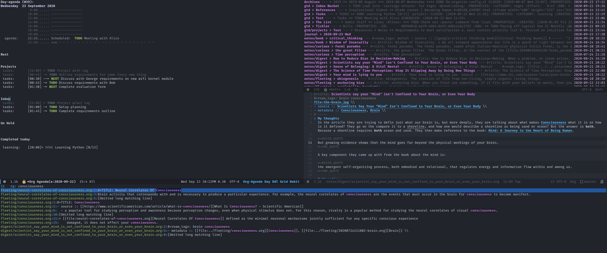
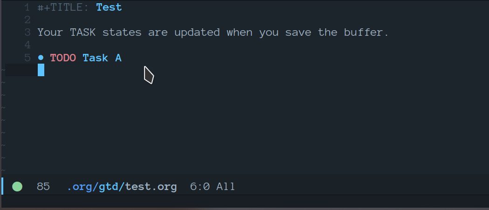
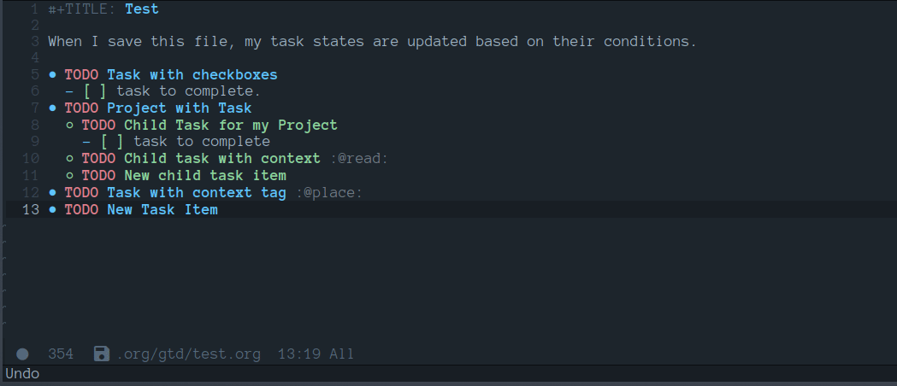
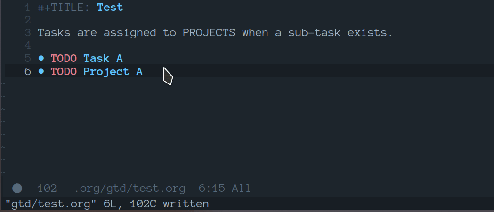

# Table of Contents

-   [New Changes](#orgc66927f)
    -   [Task Automation](#orgcbf5c39)
    -   [ID Completion](#orgcd2ca8f)
    -   [Quick Note Find Headline](#org8a74715)
    -   [Daily Task Adder](#orgb349aa0)
    -   [Add Blanklines between Headlines](#org7d3300f)
    -   [Journal Capture Template](#org6c40d00)
    -   [Setting up my productivity layout](#orgc19fd5e)
    -   [Return Indirect Buffer](#org3b84bb4)
-   [Requirements](#org6240821)
-   [Initial-Settings](#org01063d5)
-   [Org-Mode](#org5aab127)
    -   [Looks and Feels](#orgf341b9d)
    -   [Loading agenda settings](#orgf54f06c)
    -   [Clock Settings](#orgd986990)
    -   [Capture Templates](#org5405816)
    -   [Export Settings](#org3c00231)
    -   [Keywords](#orgc264af9)
    -   [Logging and Drawers](#org75e17e7)
    -   [Properties](#org381ea20)
    -   [Publishing](#org866ee26)
    -   [Default Tags](#org1b8e93c)
-   [Module Settings](#orgaa65cbb)
    -   [company mode](#org844e53a)
    -   [DEFT](#orgfb9b74b)
    -   [Elfeed](#org64fe51a)
    -   [Graphs and Chart Modules](#orgcbb9c7a)
    -   [Journal](#orge3caf67)
    -   [Org-Rifle](#org4e4adf3)
    -   [org-ql](#orgee13a0b)
    -   [Pandoc](#orgef908e8)
    -   [Reveal](#org4dcc0e1)
    -   [ROAM](#org8895a7e)
    -   [ROAM Export Backlinks + Content](#org5abd298)
    -   [ROAM Server](#orgc7d8dc3)
    -   [Super Agenda Settings](#orgd508593)
    -   [Visual Fill Column](#org52b56b1)
-   [Custom Functions](#org612f14b)
    -   [Archive keeping Structure](#org228fc08)
    -   [Custom Faces](#orga926e00)
    -   [Clarify Tasks](#org71d1036)
    -   [Change Font](#org6eb62af)
-   [End of file loading](#org1ae0f52)

Uses org-babel to tangle all of my source code blocks back to config.el, this
makes it easy so that I can write my changes from config.org or config.el.

# New Changes

## Task Automation

I got tired of manually setting task states to &ldquo;NEXT&rdquo; &ldquo;PROJ&rdquo; &ldquo;TODO&rdquo; so i&rsquo;ve
added a few functions to automate this for me.

The **NEXT** state will be set if any of the following 3 conditions exist:

1.  Has a scheduled date assign to the task. (NOTE: We may want to add additional checks for expired task)
2.  Task has a context task assigned. (Context tags start with &ldquo;@&rdquo;)
3.  Has an active checkbox that&rsquo;s not marked completed.

   

The PROJ state will become active upon the following conditions:

1.  Task has a child headline with a TODO-KEYWORD of any-type (TODO/NEXT/WAIT).

## ID Completion

I got tired of flipping back n forth between buffers, copying the ID of a
headline, then jump back and paste that ID into my link. So now i&rsquo;ll have
`org-refile-get-location` fetch the ID for us when I call `org-insert-link`.

    (require 'find-lisp)
    (defun nm/org-id-prompt-id ()
      "Prompt for the id during completion of id: link."
      (let ((org-agenda-files (find-lisp-find-files org-directory "\.org$")))
        (let ((dest (org-refile-get-location))
              (name nil)
              (id nil))
          (save-excursion
            (find-file (cadr dest))
            (goto-char (nth 3 dest))
            (setq id (org-id-get (point) t)
                  name (org-get-heading t t t t)))
          (org-insert-link nil (concat "id:" id) name))))
    
    (after! org (org-link-set-parameters "id" :complete #'nm/org-id-prompt-id))

## Quick Note Find Headline

Another pain point i&rsquo;ve been constantly facing is quickly taking a note and
storing it in the appropriate location without losing focus on what i&rsquo;m
currently working on. This is common when on calls or meetings and you need to
make a note for another task item you&rsquo;re working.

So with that, I added a new function tied to the quick note capture-template
key, which will prompt for a headline from any of your task files that exist in
&ldquo;`~/orgmode/gtd/`&rdquo;.

    (defun nm/org-capture-log ()
      "Initiate the capture system and find headline to capture under."
      (let ((dest (org-refile-get-location)))
        (let ((file (cadr dest))
              (pos (nth 3 dest))
              (title (nth 2 dest)))
          (find-file file)
          (goto-char pos)
          (nm/org-end-of-headline))))
    
    (defun nm/org-end-of-headline()
      "Move to end of current headline"
      (interactive)
      (outline-next-heading)
      (forward-char -1))

## Daily Task Adder

This function will create a new headline, and nest the checkitem underneath the
headline specified by DATE chosen during capture. This will also set a scheduled
date on the headline.

    (defun nm/org-capture-to-task-file ()
      "Capture file to your default tasks file, and prompts to select a date where to file the task file to."
      (let* ((file "~/orgmode/gtd/tasks.org")
             (parent-l nil)
             (child-l nil)
             (parent "Daily Tasks")
             (date (org-read-date))
             (heading (format "Tasks for ")))
        (find-file file)
        (goto-char 0)
        ;;; Locate or Create our parent headline
        (unless (search-forward (format "* %s" parent) nil t)
          (progn (goto-char (point-max)) (newline) (insert (format "* %s" parent))))
        ;;; Capture outline level
        (setq child-l (format "%s" (make-string (+ 1 (org-outline-level)) ?*)))
        ;;; Next we locate or create our subheading using the date string passed by the user.
        (let* ((end (save-excursion (org-end-of-subtree))))
          (unless (search-forward (format "%s NEXT %s%s" child-l heading date) end t)
            (nm/org-end-of-headline)
            (newline)
            (beginning-of-line)
            (insert (format "%s NEXT %s%s\nSCHEDULED: <%s>" child-l heading date date))))))

## Add Blanklines between Headlines

I like to keep blank lines between major headlines. The setup look something like this:

-   **Headline 1:** Keep newline between other headlines of equivelant level.
-   **Headline 2:** Keep newline between other headlines of equivelant level.
-   **Headline 3:** Do not create newline between headlines of equivelant unless its less than.
-   **Headline 4-\*:** Do not put any newlines between headlines unless its 2 or less levels.

    (defun nm/add-newline-between-headlines ()
      ""
      (when (equal major-mode 'org-mode)
        (unless (org-at-heading-p)
          (org-back-to-heading))
        (nm/org-end-of-headline)
        (if (not (org--line-empty-p 1))
            (newline))))
    
    (defun nm/add-space-end-of-line ()
      "If N-1 at end of heading is #+end_src then insert blank character on last line."
      (interactive)
      (when (equal major-mode 'org-mode)
        (unless (org-at-heading-p)
          (org-back-to-heading))
        (nm/org-end-of-headline)
        (next-line -1)
        (if (org-looking-at-p "^#\\+end_src$")
            (progn (next-line 1) (insert " ")))))
    
    (defun nm/newlines-between-headlines ()
      "Uses the org-map-entries function to scan through a buffer's
       contents and ensure newlines are inserted between headlines"
      (interactive)
      (org-map-entries #'nm/add-newline-between-headlines t 'file))
    
    (add-hook 'before-save-hook #'nm/newlines-between-headlines)

## Journal Capture Template

I need a way to make a dynamic template that will let me capture various types
of information: meeting notes, calls, conversations, things i&rsquo;m working on,
etc.. Eventually this function will contain several mini templates inside of it
that are called when initiated.

    (defun nm/capture-to-journal ()
      "When org-capture-template is initiated, it creates the respected headline structure."
      (let ((file "~/orgmode/gtd/journal.org")
            (parent nil)
            (child nil))
        (unless (file-exists-p file)
          (with-temp-buffer (write-file file)))
        (find-file file)
        (goto-char (point-min))
        ;; Search for headline, or else create it.
        (unless (re-search-forward "* Journal" nil t)
          (progn (goto-char (point-max)) (newline) (insert "* Journal")))
        (unless (re-search-forward (format "** %s" (format-time-string "%b '%y")) (save-excursion (org-end-of-subtree)) t)
          (progn (org-end-of-subtree t) (newline) (insert (format "** %s" (format-time-string "%b '%y")))))))

## Setting up my productivity layout

    (defun nm/setup-productive-windows (arg1 arg2)
      "Delete all other windows, and setup our ORGMODE production window layout."
      (interactive)
      (progn
        (delete-other-windows)
        (progn
          (find-file arg1))
        (progn
          (split-window-right)
          (evil-window-right 1)
          (org-agenda nil "n"))
        (progn
          (split-window)
          (evil-window-down 1)
          (find-file arg2)
          (goto-char 1)
          (re-search-forward (format "*+\s\\w+\sTasks\sfor\s%s" (format-time-string "%Y-%m-%d")))
          (org-tree-to-indirect-buffer))))
    
    (defun nm/productive-window ()
      "Setup"
      (interactive)
      (nm/setup-productive-windows "~/orgmode/gtd/personal.org" "~/orgmode/gtd/tasks.org"))
    
    (map! :after org
          :map org-mode-map
          :leader
          :prefix ("TAB" . "workspace")
          :desc "Load ORGMODE Setup" "," #'nm/productive-window)

## Return Indirect Buffer

    (defun nm/get-headlines-org-files (arg)
      "Searches org-directory for headline and returns results to indirect buffer."
      (interactive)
      (let ((org-agenda-files (find-lisp-find-files arg "\.org$"))
            (org-refile-use-outline-path nil)
            (org-refile-history nil))
        (let ((dest (org-refile-get-location))
              (buffer nil)
              (first (frame-first-window)))
          (save-excursion
            (if (eq first (next-window first))
                (progn (evil-window-vsplit) (evil-window-right 1))
              (other-window 1))
            (find-file (cadr dest))
            (goto-char (nth 3 dest))
            (org-tree-to-indirect-buffer)))))
    
    (defun nm/search-headlines-org-directory ()
      "Search the ORG-DIRECTORY."
      (interactive)
      (nm/get-headlines-org-files "~/orgmode/"))
    
    (defun nm/search-headlines-org-tasks-directory ()
      "Search the GTD folder."
      (interactive)
      (nm/get-headlines-org-files "~/orgmode/gtd/"))
    
    (map! :after org
          :map org-mode-map
          :leader
          :desc "Return indirect buffer org-directory" "@" #'nm/search-headlines-org-directory
          :desc "Return indirect buffer TASK files" "!" #'nm/search-headlines-org-tasks-directory)

# Requirements

These are some items that are required outside of the normal DOOM EMACS
installation, before you can use this config. The idea here is to keep this
minimum so as much of this is close to regular DOOM EMACS.

1.  **SQLITE3 Installation**: You will need to install sqlite3, typicalled installed via your package manager as `sudo apt install sqlite3`
2.  I use a few different monospace fonts: [Input](https://input.fontbureau.com/download/), [DejaVu](http://sourceforge.net/projects/dejavu/files/dejavu/2.37/dejavu-fonts-ttf-2.37.tar.bz2), [FiraCode](https://github.com/tonsky/FiraCode), [IBM Plex Mono](https://google.com/search?q=IBM Plex Mono font Download) and [Roboto Mono](https://google.com/search?q=Roboto Mono Font Download).

# Initial-Settings

User inormation and time-display:

    (setq user-full-name "Nick Martin"
          user-mail-address "nmartin84@gmail.com")
    
    (display-time-mode 1)
    (setq display-time-day-and-date t)
    
    (global-auto-revert-mode 1)
    (setq undo-limit 80000000
          evil-want-fine-undo t
          auto-save-default nil
          inhibit-compacting-font-caches t)
    (whitespace-mode -1)
    
    (setq display-line-numbers-type t)
    (setq-default
     delete-by-moving-to-trash t
     tab-width 4
     uniquify-buffer-name-style 'forward
     window-combination-resize t
     x-stretch-cursor nil)

Additioanl key bindings

    (bind-key "<f6>" #'link-hint-copy-link)
    (bind-key "<f12>" #'org-cycle-agenda-files)
    (map! :after org
          :map org-mode-map
          :leader
          :desc "Move up window" "<up>" #'evil-window-up
          :desc "Move down window" "<down>" #'evil-window-down
          :desc "Move left window" "<left>" #'evil-window-left
          :desc "Move right window" "<right>" #'evil-window-right
          :prefix ("s" . "+search")
          :desc "Outline" "o" #'counsel-outline
          :desc "Counsel ripgrep" "d" #'counsel-rg
          :desc "Swiper All" "@" #'swiper-all
          :desc "Rifle Buffer" "b" #'helm-org-rifle-current-buffer
          :desc "Rifle Agenda Files" "a" #'helm-org-rifle-agenda-files
          :desc "Rifle Project Files" "#" #'helm-org-rifle-project-files
          :desc "Rifle Other Project(s)" "$" #'helm-org-rifle-other-files
          :prefix ("l" . "+links")
          "o" #'org-open-at-point
          "g" #'eos/org-add-ids-to-headlines-in-file)
    
    (map! :after org-agenda
          :map org-agenda-mode-map
          :localleader
          :desc "Filter" "f" #'org-agenda-filter)

If I ever use terminal mode, these are some settings i&rsquo;ll want to set to increase the quality of life when working from my terminal window.

    (when (equal (window-system) nil)
      (and
       (bind-key "C-<down>" #'+org/insert-item-below)
       (setq doom-theme nil)
       (setq doom-font (font-spec :family "Roboto Mono" :size 20))))

Now I add my default folders and files that I want emacs/org-mode to use:

    (setq diary-file "~/orgmode/diary.org")
    (setq org-directory "~/orgmode/")
    (setq projectile-project-search-path "~/projects/")

Next we configure popup-rules and default fonts.

    (setq doom-theme 'doom-solarized-dark)
    
    (after! org (set-popup-rule! "^\\*lsp-help" :side 'bottom :size .30 :select t)
      (set-popup-rule! "*helm*" :side 'right :size .30 :select t)
      (set-popup-rule! "*Org QL View:*" :side 'right :size .25 :select t)
      (set-popup-rule! "*Capture*" :side 'left :size .30 :select t)
      (set-popup-rule! "*eww*" :side 'right :size .50 :select t)
      (set-popup-rule! "*CAPTURE-*" :side 'left :size .30 :select t))
    ;  (set-popup-rule! "*Org Agenda*" :side 'right :size .40 :select t))
    
    (when (equal system-type 'gnu/linux)
      (setq doom-font (font-spec :family "JetBrains Mono" :size 20 :weight 'normal)
            doom-big-font (font-spec :family "JetBrains Mono" :size 22 :weight 'normal)))
    (when (equal system-type 'windows-nt)
      (setq doom-font (font-spec :family "InputMono" :size 18)
            doom-big-font (font-spec :family "InputMono" :size 22)))

# Org-Mode

Here we add any requirements before org-mode starts to load

    (require 'org-habit)
    (require 'org-id)
    (require 'org-checklist)
    (after! org (setq org-archive-location "~/orgmode/gtd/archives.org::* %s"
                      org-image-actual-width (truncate (* (display-pixel-width) 0.15))
                      org-link-file-path-type 'relative
                      org-log-state-notes-insert-after-drawers nil
                      org-catch-invisible-edits 'error
                      org-refile-targets '((nil :maxlevel . 9)
                                           (org-agenda-files :maxlevel . 4))
                      org-refile-use-outline-path 'buffer-name
                      org-outline-path-complete-in-steps nil
                      org-refile-allow-creating-parent-nodes 'confirm
                      org-startup-indented 'indent
                      org-insert-heading-respect-content nil
                      org-startup-folded 'content
                      org-src-tab-acts-natively t
                      org-list-allow-alphabetical nil))
    
    (add-hook 'org-mode-hook 'turn-off-auto-fill)
    (add-hook 'org-mode-hook (lambda () (display-line-numbers-mode -1)))

## Looks and Feels

Here we change some of the things how org-mode looks and feels, some options
available are:

-   org-ellipsis `"▼, ↴, ⬎, ⤷,…, and ⋱."`
-   org-superstar-headline-bullets-list `"◉" "●" "○" "∴" "•"`

    (after! org (setq org-hide-emphasis-markers t
                      org-hide-leading-stars t
                      org-list-demote-modify-bullet '(("+" . "-") ("1." . "a.") ("-" . "+"))))
    
    (when (require 'org-superstar nil 'noerror)
      (setq org-superstar-headline-bullets-list '("#")
            org-superstar-item-bullet-alist nil))
    
    (when (require 'org-fancy-priorities nil 'noerror)
      (setq org-fancy-priorities-list '("⚑" "❗" "⬆")))

## Loading agenda settings

    (after! org (setq org-agenda-diary-file "~/orgmode/diary.org"
                      org-agenda-dim-blocked-tasks t ; grays out task items that are blocked by another task (EG: Projects with subtasks)
                      org-agenda-use-time-grid nil
                      org-agenda-tags-column 0
    ;                  org-agenda-hide-tags-regexp "\\w+" ; Hides tags in agenda-view
                      org-agenda-compact-blocks nil
                      org-agenda-block-separator ""
                      org-agenda-skip-scheduled-if-done t
                      org-agenda-skip-deadline-if-done t
                      org-agenda-window-setup 'current-window
                      org-enforce-todo-checkbox-dependencies nil ; This has funny behavior, when t and you try changing a value on the parent task, it can lead to Emacs freezing up. TODO See if we can fix the freezing behavior when making changes in org-agenda-mode.
                      org-enforce-todo-dependencies t
                      org-habit-show-habits t))
    
    (after! org (setq org-agenda-files (append (file-expand-wildcards "~/orgmode/gtd/*.org") (file-expand-wildcards "~/orgmode/gtd/*/*.org"))))

## Clock Settings

    (after! org (setq org-clock-continuously t)) ; Will fill in gaps between the last and current clocked-in task.

## Capture Templates

What templates do I need available for quick capture of information? This seems it would fall under 2-3 categories:

1.  Task Items
2.  Notes
3.  Journal
4.  Resources

Task items can be a few different things, and there&rsquo;s the whole GTD which i&rsquo;m
trying my bestest to follow. Sometimes I may have a task item that I simply need
to remind myself to complete, and just need to check it off a list acknowledging
i&rsquo;ve completed it and other times I need an actual task item to capture and
track data in.

Task items are important, but some are not always important enough to be giving
a due date, or to record any data from the task&#x2026; I just simply need to mark it
on my list to serve as a simple reminder.

    (setq org-capture-templates '(("!" "Quick Task" checkitem (file+olp "~/orgmode/gtd/tasks.org" "Tasks") "- [ ] %?")))

Other task items are more important though, and I need to specify a date they
need to be completed on, but again&#x2026; there&rsquo;s no urgency of recording any data
for these tasks so I simply log it as a checklist.

    (push '("d" "Task by Date" checkitem (function nm/org-capture-to-task-file) "- [ ] %?") org-capture-templates)

Beyond regular checklist items, I sometimes need to capture something that
requires more time to research, perform, investigate, or simply have a
recollection of my thoughts on at a later date&#x2026; This is when the GTD method
kicks in and I log a new task to my INBOX.

    ;; It's important that I capture what I have in my mind at this time I create this new entry...
    ;; Do not finish right away... Give myself a chance to add some extra notes before we file away...
    (push '("i" "Capture to inbox" entry (file+olp "~/orgmode/gtd/inbox.org" "Inbox") "* TODO %^{task}\n:PROPERTIES:\n:CREATED: %U\n:END:\n%^{Why are we capturing?}") org-capture-templates)

Occassionally I do like to take a note in my journal, to make a mental note of
my day&#x2026;

    (push '("j" "Journal Entry" entry (function nm/capture-to-journal) "* %^{entry} :thoughts:\n:PROPERTIES:\n:CREATED: %U\n:END:\n%?" :immediate-finish t) org-capture-templates)

Sometimes i&rsquo;ll just start working on things that I find interseting, and I need
a method of take notes on what i&rsquo;m doing so I can keep track of what I discover
and document those things back into my master notes file.

    (push '("w" "Working on" entry (file+olp "~/orgmode/gtd/journal.org" "Working on") "* %^{Working on what?}\n:PROPERTIES:\n:CREATED: %U\n:END:\n%?" :clock-in t :clock-resume t) org-capture-templates)

With my crazy busy scheduled, I can end up working on multiple things at any
given time&#x2026; and I need a way to quickly log a note for another task item i&rsquo;m
working&#x2026; So i&rsquo;ve written up a small function that utilizes
`org-refile-get-location` to locate the headline and capture under the selected
headline.

    (push '("a" "Add note on Task" plain (function nm/org-capture-log) "#+caption: recap of \"%^{summary}\" on [%<%Y-%m-%d %a %H:%M>]\n%?" :empty-lines-before 1 :empty-lines-after 1) org-capture-templates)

## Export Settings

    (after! org (setq org-html-head-include-scripts t
                      org-export-with-toc t
                      org-export-with-author t
                      org-export-headline-levels 4
                      org-export-with-drawers nil
                      org-export-with-email t
                      org-export-with-footnotes t
                      org-export-with-sub-superscripts nil
                      org-export-with-latex t
                      org-export-with-section-numbers nil
                      org-export-with-properties nil
                      org-export-with-smart-quotes t
                      org-export-backends '(pdf ascii html latex odt md pandoc)))

Embed images into the exported HTML files.

    (defun replace-in-string (what with in)
      (replace-regexp-in-string (regexp-quote what) with in nil 'literal))
    
    (defun org-html--format-image (source attributes info)
      (progn
        (setq source (replace-in-string "%20" " " source))
        (format ""
                (or (file-name-extension source) "")
                (base64-encode-string
                 (with-temp-buffer
                   (insert-file-contents-literally source)
                  (buffer-string)))
                (file-name-nondirectory source))))

## Keywords

After much feedback and discussing with other users, I decided to simplify the keyword list to make it simple. Defining a project will now focus on the tag word **:project:** so that all child task are treated as part of the project.

<table border="2" cellspacing="0" cellpadding="6" rules="groups" frame="hsides">

<colgroup>
<col  class="org-left" />

<col  class="org-left" />
</colgroup>
<thead>
<tr>
<th scope="col" class="org-left">Keyword</th>
<th scope="col" class="org-left">Description</th>
</tr>
</thead>

<tbody>
<tr>
<td class="org-left">\TODO</td>
<td class="org-left">Task has actionable items defined and ready to be worked.</td>
</tr>

<tr>
<td class="org-left">HOLD</td>
<td class="org-left">Has actionable items, but is on hold due to various reasons.</td>
</tr>

<tr>
<td class="org-left">NEXT</td>
<td class="org-left">Is ready to be worked and should be worked on soon.</td>
</tr>

<tr>
<td class="org-left">DONE</td>
<td class="org-left">Task is completed and closed.</td>
</tr>

<tr>
<td class="org-left">KILL</td>
<td class="org-left">Abandoned or terminated.</td>
</tr>
</tbody>
</table>

    (custom-declare-face '+org-todo-active  '((t (:inherit (bold font-lock-constant-face org-todo)))) "")
    (custom-declare-face '+org-todo-project '((t (:inherit (bold font-lock-doc-face org-todo)))) "")
    (custom-declare-face '+org-todo-onhold  '((t (:inherit (bold warning org-todo)))) "")
    (custom-declare-face '+org-todo-next '((t (:inherit (bold font-lock-keyword-face org-todo)))) "")
    (custom-declare-face 'org-checkbox-statistics-todo '((t (:inherit (bold font-lock-constant-face org-todo)))) "")
    
      (setq org-todo-keywords
            '((sequence
               "TODO(t)"  ; A task that needs doing & is ready to do
               "PROJ(p)"  ; Project with multiple task items.
               "NEXT(n)"  ; Task is next to be worked on.
               "WAIT(w)"  ; Something external is holding up this task
               "|"
               "DONE(d)"  ; Task successfully completed
               "KILL(k)")) ; Task was cancelled, aborted or is no longer applicable
            org-todo-keyword-faces
            '(("WAIT" . +org-todo-onhold)
              ("PROJ" . +org-todo-project)
              ("TODO" . +org-todo-active)
              ("NEXT" . +org-todo-next)))

## Logging and Drawers

Next, we like to keep a history of our activity of a task so we **track** when changes occur, and we also keep our notes logged in **their own drawer**. Optionally you can also add the following in-buffer settings to override the `org-log-into-drawer` function. `#+STARTUP: logdrawer` or `#+STARTUP: nologdrawer`

    (after! org (setq org-log-into-drawer t
                      org-log-done 'time
                      org-log-repeat 'time
                      org-log-redeadline 'note
                      org-log-reschedule 'note))

## Properties

    (after! org (setq org-use-property-inheritance t)) ; We like to inhert properties from their parents

## Publishing

REVIEW do we need to re-define our publish settings for the ROAM directory?

    (after! org (setq org-publish-project-alist
                      '(("attachments"
                         :base-directory "~/orgmode/"
                         :recursive t
                         :base-extension "jpg\\|jpeg\\|png\\|pdf\\|css"
                         :publishing-directory "~/publish_html"
                         :publishing-function org-publish-attachment)
                        ("org files to MD"
                         :base-directory "~/orgmode/"
                         :publishing-directory "~/org-md/"
                         :base-extension "org"
                         :recursive t
                         :publishing-function org-md-publish-to-md)
                        ("notes"
                         :base-directory "~/orgmode/notes/"
                         :publishing-directory "~/nmartin84.github.io"
                         :section-numbers nil
                         :base-extension "org"
                         :with-properties nil
                         :with-drawers (not "LOGBOOK")
                         :with-timestamps active
                         :recursive t
                         :exclude "journal/.*"
                         :auto-sitemap t
                         :sitemap-filename "index.html"
                         :publishing-function org-html-publish-to-html
                         :html-head "<link rel=\"stylesheet\" href=\"https://raw.githack.com/nmartin84/raw-files/master/htmlpro.css\" type=\"text/css\"/>"
    ;                     :html-head "<link rel=\"stylesheet\" href=\"https://codepen.io/nmartin84/pen/RwPzMPe.css\" type=\"text/css\"/>"
    ;                     :html-head-extra ""
                         :html-link-up "../"
                         :with-email t
                         :html-link-up "../../index.html"
                         :auto-preamble t
                         :with-toc t)
                        ("myprojectweb" :components("attachments" "notes" "org files to MD")))))

## Default Tags

    (after! org (setq org-tags-column 0
                      org-tag-alist '((:startgrouptag)
                                      (:grouptags)
                                      ("@home" . ?h)
                                      ("@computer")
                                      ("@work")
                                      ("@place")
                                      ("@bills")
                                      ("@order")
                                      ("@labor")
                                      ("@read")
                                      ("@brainstorm")
                                      ("@planning")
                                      ("WAIT")
                                      ("SOMEDAY"))))

# Module Settings

## company mode

    (after! org
      (set-company-backend! 'org-mode 'company-capf '(company-yasnippet company-elisp))
      (setq company-idle-delay 0.25))

## DEFT

When this variable is set to `t` your deft directory will be updated to your projectile-project root&rsquo;s folder when switching projects, and the deft buffer&rsquo;s contents will be refreshed.

    (setq deft-use-projectile-projects t)
    (defun zyro/deft-update-directory ()
      "Updates deft directory to current projectile's project root folder and updates the deft buffer."
      (interactive)
      (if (projectile-project-p)
          (setq deft-directory (expand-file-name (doom-project-root)))))
    (when deft-use-projectile-projects
      (add-hook 'projectile-after-switch-project-hook 'zyro/deft-update-directory)
      (add-hook 'projectile-after-switch-project-hook 'deft-refresh))

Configuring DEFT default settings

    (use-package deft
      :bind (("<f8>" . deft))
      :commands (deft deft-open-file deft-new-file-named)
      :config
      (setq deft-directory "~/orgmode/"
            deft-auto-save-interval 0
            deft-recursive t
            deft-current-sort-method 'title
            deft-extensions '("md" "txt" "org")
            deft-use-filter-string-for-filename t
            deft-use-filename-as-title nil
            deft-markdown-mode-title-level 1
            deft-file-naming-rules '((nospace . "-"))))
    
    (defun my-deft/strip-quotes (str)
      (cond ((string-match "\"\\(.+\\)\"" str) (match-string 1 str))
            ((string-match "'\\(.+\\)'" str) (match-string 1 str))
            (t str)))
    
    (defun my-deft/parse-title-from-front-matter-data (str)
      (if (string-match "^title: \\(.+\\)" str)
          (let* ((title-text (my-deft/strip-quotes (match-string 1 str)))
                 (is-draft (string-match "^draft: true" str)))
            (concat (if is-draft "[DRAFT] " "") title-text))))
    
    (defun my-deft/deft-file-relative-directory (filename)
      (file-name-directory (file-relative-name filename deft-directory)))
    
    (defun my-deft/title-prefix-from-file-name (filename)
      (let ((reldir (my-deft/deft-file-relative-directory filename)))
        (if reldir
            (concat (directory-file-name reldir) " > "))))
    
    (defun my-deft/parse-title-with-directory-prepended (orig &rest args)
      (let ((str (nth 1 args))
            (filename (car args)))
        (concat
          (my-deft/title-prefix-from-file-name filename)
          (let ((nondir (file-name-nondirectory filename)))
            (if (or (string-prefix-p "README" nondir)
                    (string-suffix-p ".txt" filename))
                nondir
              (if (string-prefix-p "---\n" str)
                  (my-deft/parse-title-from-front-matter-data
                   (car (split-string (substring str 4) "\n---\n")))
                (apply orig args)))))))
    
    (provide 'my-deft-title)
    
    (advice-add 'deft-parse-title :around #'my-deft/parse-title-with-directory-prepended)

## Elfeed

    (use-package elfeed-org
      :defer
      :config
      (setq rmh-elfeed-org-files (list "~/orgmode/elfeed.org")))
    (use-package elfeed
      :defer
      :config
      (setq elfeed-db-directory "~/.elfeed/"))
    
    ;; (require 'elfeed-org)
    ;; (elfeed-org)
    ;; (setq elfeed-db-directory "~/.elfeed/")
    ;; (setq rmh-elfeed-org-files (list "~/.elfeed/elfeed.org"))

## Graphs and Chart Modules

Eventually I would like to have org-mind-map generating charts like Sacha&rsquo;s [evil-plans](https://pages.sachachua.com/evil-plans/).

    (after! org (setq org-ditaa-jar-path "~/.emacs.d/.local/straight/repos/org-mode/contrib/scripts/ditaa.jar"))
    
    (use-package gnuplot
      :defer
      :config
      (setq gnuplot-program "gnuplot"))
    
    ; MERMAID
    (use-package mermaid-mode
      :defer
      :config
      (setq mermaid-mmdc-location "/node_modules/.bin/mmdc"
            ob-mermaid-cli-path "/node-modules/.bin/mmdc"))
    
    ; PLANTUML
    (use-package ob-plantuml
      :ensure nil
      :commands
      (org-babel-execute:plantuml)
      :defer
      :config
      (setq plantuml-jar-path (expand-file-name "~/.doom.d/plantuml.jar")))

## Journal

    (after! org (setq org-journal-dir "~/orgmode/gtd/journal/"
                      org-journal-enable-agenda-integration t
                      org-journal-file-type 'monthly
                      org-journal-carryover-items "TODO=\"TODO\"|TODO=\"NEXT\"|TODO=\"PROJ\"|TODO=\"STRT\"|TODO=\"WAIT\"|TODO=\"HOLD\""))

## Org-Rifle

    (use-package helm-org-rifle
      :after (helm org)
      :preface
      (autoload 'helm-org-rifle-wiki "helm-org-rifle")
      :config
      (add-to-list 'helm-org-rifle-actions '("Insert link" . helm-org-rifle--insert-link) t)
      (add-to-list 'helm-org-rifle-actions '("Store link" . helm-org-rifle--store-link) t)
      (defun helm-org-rifle--store-link (candidate &optional use-custom-id)
        "Store a link to CANDIDATE."
        (-let (((buffer . pos) candidate))
          (with-current-buffer buffer
            (org-with-wide-buffer
             (goto-char pos)
             (when (and use-custom-id
                        (not (org-entry-get nil "CUSTOM_ID")))
               (org-set-property "CUSTOM_ID"
                                 (read-string (format "Set CUSTOM_ID for %s: "
                                                      (substring-no-properties
                                                       (org-format-outline-path
                                                        (org-get-outline-path t nil))))
                                              (helm-org-rifle--make-default-custom-id
                                               (nth 4 (org-heading-components))))))
             (call-interactively 'org-store-link)))))
    
      ;; (defun helm-org-rifle--narrow (candidate)
      ;;   "Go-to and then Narrow Selection"
      ;;   (helm-org-rifle-show-entry candidate)
      ;;   (org-narrow-to-subtree))
    
      (defun helm-org-rifle--store-link-with-custom-id (candidate)
        "Store a link to CANDIDATE with a custom ID.."
        (helm-org-rifle--store-link candidate 'use-custom-id))
    
      (defun helm-org-rifle--insert-link (candidate &optional use-custom-id)
        "Insert a link to CANDIDATE."
        (unless (derived-mode-p 'org-mode)
          (user-error "Cannot insert a link into a non-org-mode"))
        (let ((orig-marker (point-marker)))
          (helm-org-rifle--store-link candidate use-custom-id)
          (-let (((dest label) (pop org-stored-links)))
            (org-goto-marker-or-bmk orig-marker)
            (org-insert-link nil dest label)
            (message "Inserted a link to %s" dest))))
    
      (defun helm-org-rifle--make-default-custom-id (title)
        (downcase (replace-regexp-in-string "[[:space:]]" "-" title)))
    
      (defun helm-org-rifle--insert-link-with-custom-id (candidate)
        "Insert a link to CANDIDATE with a custom ID."
        (helm-org-rifle--insert-link candidate t))
    
      (helm-org-rifle-define-command
       "wiki" ()
       "Search in \"~/lib/notes/writing\" and `plain-org-wiki-directory' or create a new wiki entry"
       :sources `(,(helm-build-sync-source "Exact wiki entry"
                     :candidates (plain-org-wiki-files)
                     :action #'plain-org-wiki-find-file)
                  ,@(--map (helm-org-rifle-get-source-for-file it) files)
                  ,(helm-build-dummy-source "Wiki entry"
                     :action #'plain-org-wiki-find-file))
       :let ((files (let ((directories (list "~/lib/notes/writing"
                                             plain-org-wiki-directory
                                             "~/lib/notes")))
                      (-flatten (--map (f-files it
                                                (lambda (file)
                                                  (s-matches? helm-org-rifle-directories-filename-regexp
                                                              (f-filename file))))
                                       directories))))
             (helm-candidate-separator " ")
             (helm-cleanup-hook (lambda ()
                                  ;; Close new buffers if enabled
                                  (when helm-org-rifle-close-unopened-file-buffers
                                    (if (= 0 helm-exit-status)
                                        ;; Candidate selected; close other new buffers
                                        (let ((candidate-source (helm-attr 'name (helm-get-current-source))))
                                          (dolist (source helm-sources)
                                            (unless (or (equal (helm-attr 'name source)
                                                               candidate-source)
                                                        (not (helm-attr 'new-buffer source)))
                                              (kill-buffer (helm-attr 'buffer source)))))
                                      ;; No candidates; close all new buffers
                                      (dolist (source helm-sources)
                                        (when (helm-attr 'new-buffer source)
                                          (kill-buffer (helm-attr 'buffer source))))))))))
      :general
      (:keymaps 'org-mode-map
       "M-s r" #'helm-org-rifle-current-buffer)
      :custom
      (helm-org-rifle-directories-recursive t)
      (helm-org-rifle-show-path t)
      (helm-org-rifle-test-against-path t))
    
    (provide 'setup-helm-org-rifle)

## org-ql

    (setq org-ql-views '(("Overview: Agenda-like" :buffers-files org-agenda-files :query
                          (and (not (done))
                               (or (habit) (deadline auto) (scheduled :to today) (scheduled :on today)))
                          :sort
                          (date priority todo)
                          :super-groups org-super-agenda-groups :title "Agenda Like")
                         ("Overview: Project Sub-tasks" :buffers-files org-agenda-files
                          :query (and (todo "TODO" "NEXT" "WAIT") (ancestors (todo "PROJ")))
                          :sort nil :narrow nil :super-groups ((:auto-parent t))
                          :title "Overview: Project Sub-tasks")
                         ("Overview: Sub-projects" :buffers-files org-agenda-files
                          :query (and (todo "PROJ") (ancestors (todo "PROJ")))
                          :sort nil :narrow nil
                          :super-groups ((:auto-parent t))
                          :title "Overview: Sub-projects")
                         ("Inbox Bucket" :buffers-files org-agenda-files
                          :query (and (todo "TODO") (not (tags "SOMEDAY")))
                          :sort (date)
                          :narrow nil :super-groups ((:auto-ts t))  :title "Inbox Bucket")
                         ("Recent Items" :buffers-files org-agenda-files
                          :query (and (ts :from -7 :to today) (not (or (todo) (todo "DONE"))))
                          :sort (date)
                          :narrow nil
                          :super-groups ((:auto-ts t))
                          :title "Recent Items")))
    
    (map! :after org
          :map org-mode-map
          :leader
          :prefix ("o" . "open")
          :desc "org-ql" "q" #'org-ql-view)
    
    (bind-key "<f9>" #'org-ql-view)

## Pandoc

    (setq org-pandoc-options '((standalone . t) (self-contained . t)))

## Reveal

    (require 'ox-reveal)
    (setq org-reveal-root "https://cdn.jsdelivr.net/npm/reveal.js")
    (setq org-reveal-title-slide nil)

## ROAM

These are my default ROAM settings

    (setq org-roam-tag-sources '(prop last-directory))
    (setq org-roam-db-location "~/orgmode/notes/roam.db")
    (setq org-roam-directory "~/orgmode/notes/")
    
    (use-package company-org-roam
      :ensure t
      ;; You may want to pin in case the version from stable.melpa.org is not working
      ; :pin melpa
      :config
      (push 'company-org-roam company-backends))
    
    (setq org-roam-dailies-capture-templates
       '(("d" "daily" plain (function org-roam-capture--get-point) ""
          :immediate-finish t
          :file-name "journal/%<%Y-%m-%d-%a>"
          :head "#+TITLE: %<%Y-%m-%d %a>\n#+STARTUP: content\n\n")))
    
    (setq org-roam-capture-templates
            '(("d" "digest" plain (function org-roam-capture--get-point)
               "%?"
               :file-name "digest/%<%Y%m%d%H%M>-${slug}"
               :head "#+title: ${title}\n#+roam_tags: %^{roam_tags}\n\nsource :: [[%^{link}][%^{link_desc}]]\n\n"
               :unnarrowed t)
              ("n" "notes" plain (function org-roam-capture--get-point)
               :file-name "${slug}"
               :head "#+title: ${title}\n#+roam_tags: %(read-string \"tags: \")\n\n"
               :unnarrowed t
               "%?")
              ("p" "private" plain (function org-roam-capture--get-point)
               :file-name "private/${slug}"
               :head "#+title: ${title}\n#+roam_tags: %(read-string \"tags: \")\n\n"
               :unnarrowed t
               "%?")
              ("r" "reveal slide" plain (function org-roam-capture--get-point)
               :file-name "slides/%<%Y%m%d%H%M>-${slug}"
               :head "#+title: ${title}\n#+options: num:nil toc:nil\n#+REVEAL_THEME: %^{theme|black|white|league|beige|sky|night|serif|simple|solarized|blood|moon}\n#+REVEAL_PLUGINS: (highlight)\n#+REVEAL_OVERVIEW: t\n\n"
               :unnarrow t
               "%?")))

## ROAM Export Backlinks + Content

    (defun my/org-roam--backlinks-list-with-content (file)
      (with-temp-buffer
        (if-let* ((backlinks (org-roam--get-backlinks file))
                  (grouped-backlinks (--group-by (nth 0 it) backlinks)))
            (progn
              (insert (format "\n\n* %d Backlinks\n"
                              (length backlinks)))
              (dolist (group grouped-backlinks)
                (let ((file-from (car group))
                      (bls (cdr group)))
                  (insert (format "** [[file:%s][%s]]\n"
                                  file-from
                                  (org-roam--get-title-or-slug file-from)))
                  (dolist (backlink bls)
                    (pcase-let ((`(,file-from _ ,props) backlink))
                      (insert (s-trim (s-replace "\n" " " (plist-get props :content))))
                      (insert "\n\n")))))))
        (buffer-string)))
    
    (defun my/org-export-preprocessor (backend)
      (let ((links (my/org-roam--backlinks-list-with-content (buffer-file-name))))
        (unless (string= links "")
          (save-excursion
            (goto-char (point-max))
            (insert (concat "\n* Backlinks\n") links)))))
    
    (add-hook 'org-export-before-processing-hook 'my/org-export-preprocessor)

## ROAM Server

    (use-package org-roam-server
      :ensure t
      :config
      (setq org-roam-server-host "127.0.0.1"
            org-roam-server-port 8070
            org-roam-server-export-inline-images t
            org-roam-server-authenticate nil
            org-roam-server-network-poll nil
            org-roam-server-network-arrows 'from
            org-roam-server-network-label-truncate t
            org-roam-server-network-label-truncate-length 60
            org-roam-server-network-label-wrap-length 20))

## Super Agenda Settings

    (setq org-super-agenda-mode t
          org-agenda-todo-ignore-scheduled 'future
          org-agenda-tags-todo-honor-ignore-options t
          org-agenda-fontify-priorities t)
    
    (setq org-agenda-custom-commands
          (quote (("N" "Notes" tags "NOTE"
                   ((org-agenda-overriding-header "Notes")
                    (org-tags-match-list-sublevels t)))
                  ("h" "Habits" tags-todo "STYLE=\"habit\""
                   ((org-agenda-overriding-header "Habits")
                    (org-agenda-sorting-strategy
                     '(todo-state-down effort-up category-keep))))
                  ("n" "Next Actions"
                   ((agenda ""
                            ((org-agenda-span '1)
                             (org-agenda-files (append (file-expand-wildcards "~/orgmode/gtd/*.org")))
                             (org-agenda-start-day (org-today))))
                    (tags-todo "-@delegated/-PROJ-TODO-WAIT-WATCH"
                               ((org-agenda-overriding-header "Project Tasks")
                                (org-agenda-skip-function 'bh/skip-non-projects)
                                (org-agenda-sorting-strategy
                                 '(category-up))))
                    (tags-todo "-SOMEDAY-@delegated/-TODO-WAIT-PROJ-WATCH"
                               ((org-agenda-overriding-header (concat "Standalone Tasks"))
                                (org-agenda-skip-function 'nm/skip-project-tasks)
                                (org-agenda-todo-ignore-scheduled t)
                                (org-agenda-todo-ignore-deadlines t)
                                (org-agenda-todo-ignore-with-date t)
                                (org-agenda-sorting-strategy '(category-up))))
                    (tags-todo "-SOMEDAY-@delegated/WATCH"
                               ((org-agenda-overriding-header "Keep eye on")
                                (org-agenda-sorting-strategy '(category-keep))))
                    (tags-todo "@delegated/!"
                               ((org-agenda-overriding-header "Delegated")
                                (org-agenda-todo-ignore-scheduled t)
                                (org-agenda-todo-ignore-deadlines t)
                                (org-agenda-todo-ignore-with-date t)
                                (org-agenda-sorting-strategy '(category-keep))))
                    (tags-todo "-@delegated/WAIT"
                               ((org-agenda-overriding-header "On Hold")
                                (org-agenda-sorting-strategy
                                 '(category-keep))))
                    (tags-todo "-SOMEDAY/TODO"
                               ((org-tags-match-list-sublevels nil)
                                (org-agenda-overriding-header "Inbox Bucket")))
                    (tags-todo "-@delegated/PROJ"
                               ((org-agenda-overriding-header "Projects")
                                (org-agenda-skip-function 'bh/skip-non-projects)
                                (org-tags-match-list-sublevels 'indented)
                                (org-agenda-sorting-strategy
                                 '(category-keep))))))
                  ("r" "Review"
                   ((tags-todo "-CANCELLED/!"
                               ((org-agenda-overriding-header "Stuck Projects")
                                (org-agenda-skip-function 'bh/skip-non-stuck-projects)
                                (org-agenda-sorting-strategy
                                 '(category-keep))))
                    (tags-todo "-SOMEDAY-REFILE-CANCELLED-WAITING-HOLD/!"
                               ((org-agenda-overriding-header (concat "Project Subtasks"
                                                                      (if bh/hide-scheduled-and-waiting-next-tasks
                                                                          ""
                                                                        " (including WAITING and SCHEDULED tasks)")))
                                (org-agenda-skip-function 'bh/skip-non-project-tasks)
                                (org-agenda-todo-ignore-scheduled bh/hide-scheduled-and-waiting-next-tasks)
                                (org-agenda-todo-ignore-deadlines bh/hide-scheduled-and-waiting-next-tasks)
                                (org-agenda-todo-ignore-with-date bh/hide-scheduled-and-waiting-next-tasks)
                                (org-agenda-sorting-strategy
                                 '(category-keep))))
                    (tags-todo "-SOMEDAY/TODO"
                               ((org-tags-match-list-sublevels nil)
                                (org-agenda-overriding-header "Inbox Bucket")))
                    (tags-todo "SOMEDAY/"
                               ((org-agenda-overriding-header "Someday Tasks")
                                (org-agenda-skip-function 'nm/skip-scheduled)
                                (org-tags-match-list-sublevels nil)
                                (org-agenda-todo-ignore-scheduled bh/hide-scheduled-and-waiting-next-tasks)
                                (org-agenda-todo-ignore-deadlines bh/hide-scheduled-and-waiting-next-tasks))))))))

## Visual Fill Column

    (setq visual-fill-column 120)

# Custom Functions

    (load! "org-helpers.el")

## Archive keeping Structure

    (defadvice org-archive-subtree (around fix-hierarchy activate)
      (let* ((fix-archive-p (and (not current-prefix-arg)
                                 (not (use-region-p))))
             (location (org-archive--compute-location org-archive-location))
             (afile (car location))
             (offset (if (= 0 (length (cdr location)))
                         1
                       (1+ (string-match "[^*]" (cdr location)))))
             (buffer (or (find-buffer-visiting afile) (find-file-noselect afile))))
        ad-do-it
        (when fix-archive-p
          (with-current-buffer buffer
            (goto-char (point-max))
            (while (> (org-current-level) offset) (org-up-heading-safe))
            (let* ((olpath (org-entry-get (point) "ARCHIVE_OLPATH"))
                   (path (and olpath (split-string olpath "/")))
                   (level offset)
                   tree-text)
              (when olpath
                (org-mark-subtree)
                (setq tree-text (buffer-substring (region-beginning) (region-end)))
                (let (this-command) (org-cut-subtree))
                (goto-char (point-min))
                (save-restriction
                  (widen)
                  (-each path
                    (lambda (heading)
                      (if (re-search-forward
                           (rx-to-string
                            `(: bol (repeat ,level "*") (1+ " ") ,heading)) nil t)
                          (org-narrow-to-subtree)
                        (goto-char (point-max))
                        (unless (looking-at "^")
                          (insert "\n"))
                        (insert (make-string level ?*)
                                " "
                                heading
                                "\n"))
                      (cl-incf level)))
                  (widen)
                  (org-end-of-subtree t t)
                  (org-paste-subtree level tree-text))))))))

## Custom Faces

    (defface org-logbook-note
      '((t (:foreground "LightSkyBlue")))
      "Face for printr function")
    
    (font-lock-add-keywords
     'org-mode
     '(("\\w+\s\\w+\s\\w+\s\\[\\w+-\\w+-\\w+\s\\w+\s\\w+:\\w+\\] \\\\\\\\" . 'org-logbook-note )))

## Clarify Tasks

Clarify task will take a list of property fields and pass them to `nm/org-clarify-task-properties` to update task items which are missing those property fields.

    (defun nm/org-get-headline-property (arg)
      "Extract property from headline and return results."
      (interactive)
      (org-entry-get nil arg t))
    
    (defun nm/org-get-headline-properties ()
      "Get headline properties for ARG."
      (org-back-to-heading)
      (org-element-at-point))
    
    (defun nm/org-get-headline-title ()
      "Get headline title from current headline."
      (interactive)
      (org-element-property :title (nm/org-get-headline-properties)))
    
    ;;;;;;;;;;;;--------[ Clarify Task Properties ]----------;;;;;;;;;;;;;
    
    (defun nm/org-clarify-metadata ()
      "Runs the clarify-task-metadata function with ARG being a list of property values." ; TODO work on this function and add some meaning to it.
      (interactive)
      (nm/org-clarify-task-properties org-tasks-properties-metadata))
    
    (load! "org-task-automation.el")
    
    (map! :after org
          :map org-mode-map
          :localleader
          :prefix ("j" . "nicks functions")
          :desc "Clarify properties" "c" #'nm/org-clarify-metadata)

## Change Font

    (defun nm/emacs-change-font ()
      "Change font based on available font list."
      (interactive)
      (let ((font (ivy-completing-read "font: " nm/font-family-list))
            (size (ivy-completing-read "size: " '("16" "18" "20" "22" "24" "26" "28" "30")))
            (weight (ivy-completing-read "weight: " '(normal light bold extra-light ultra-light semi-light extra-bold ultra-bold)))
            (width (ivy-completing-read "width: " '(normal condensed expanded ultra-condensed extra-condensed semi-condensed semi-expanded extra-expanded ultra-expanded))))
        (setq doom-font (font-spec :family font :size (string-to-number size) :weight (intern weight) :width (intern width))
              doom-big-font (font-spec :family font :size (+ 2 (string-to-number size)) :weight (intern weight) :width (intern width))))
      (doom/reload-font))
    
    (defvar nm/font-family-list '("JetBrains Mono" "Roboto Mono" "Fira Code" "Hack" "Input Mono" "Anonymous Pro" "Cousine" "PT Mono" "DejaVu Sans Mono" "Victor Mono" "Liberation Mono"))

# End of file loading

Load secrets from here&#x2026;

    (let ((secrets (expand-file-name "secrets.el" doom-private-dir)))
    (when (file-exists-p secrets)
      (load secrets)))

