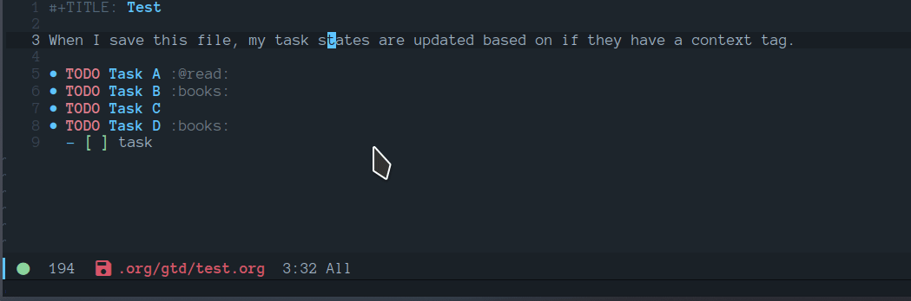

# Table of Contents

-   [New Changes](#org46c7590)
    -   [Clarify Tasks](#orga85ee1a)
-   [Requirements](#org8128d6a)
-   [Initial-Settings](#org0070d07)
-   [Org-Mode](#orgbdfba30)
    -   [Looks and Feels](#org0444e7a)
    -   [Loading agenda settings](#orgdf4f030)
    -   [Clock Settings](#org2af17f1)
    -   [Capture Templates](#org17b35af)
    -   [Export Settings](#org605c203)
    -   [Keywords](#orgb92aad6)
    -   [Logging and Drawers](#orgbdbab62)
    -   [Properties](#org18186a4)
    -   [Publishing](#orgf2fa524)
    -   [Default Tags](#orgda5463f)
-   [Module Settings](#org64ed8f1)
    -   [company mode](#orge3ec3a3)
    -   [DEFT](#org56447fc)
    -   [Elfeed](#org9c3b61d)
    -   [Graphs and Chart Modules](#org67773ec)
    -   [Journal](#orgd3f336d)
    -   [Org-Rifle](#org646d361)
    -   [org-ql](#orgf4201ca)
    -   [Pandoc](#org80921e2)
    -   [Reveal](#org30d74d9)
    -   [ROAM](#org818565d)
    -   [ROAM Export Backlinks + Content](#org057de8b)
    -   [ROAM Server](#org141ef8c)
    -   [Super Agenda Settings](#orgcdaa4bf)
-   [Custom Functions](#org5e9783c)
    -   [Time Stamps](#org6e71c84)
    -   [Prompt for headline when creating ID links](#org50cc8cc)
    -   [Capture Template File Picker](#org9a15eca)
    -   [Clarify Tasks](#orgef46cd2)
    -   [Capture headline finder](#org74aca6d)
    -   [Search for headline across org-directory and return to indirect buffer](#orgf2184e6)
    -   [Change Font](#orgf660a20)
-   [End of file loading](#org14b3532)

Uses org-babel to tangle all of my source code blocks back to config.el, this makes it easy so that I can write my changes from config.org or config.el.

# New Changes

## Clarify Tasks

I got tired of manually setting task states to &ldquo;NEXT&rdquo; &ldquo;PROJ&rdquo; &ldquo;TODO&rdquo; so i&rsquo;ve added a few functions to automate this based on a few conditions.

The **NEXT** state will be set if any of the following 3 conditions exist:

1.  Has a scheduled date assign to the task. (NOTE: We may want to add additional checks for expired task)
2.  Task has a context task assigned. (Context tags start with &ldquo;@&rdquo;)
3.  Has an active checkbox that&rsquo;s not marked completed.

   

The PROJ state will become active upon the following conditions:

1.  Task has a child headline with a TODO-KEYWORD of any-type (TODO/NEXT/WAIT).

# Requirements

These are some items that are required outside of the normal DOOM EMACS installation, before you can use this config. The idea here is to keep this minimum so as much of this is close to regular DOOM EMACS.

1.  **SQLITE3 Installation**: You will need to install sqlite3, typicalled installed via your package manager as `sudo apt install sqlite3`
2.  I use a few different monospace fonts: [Input](https://input.fontbureau.com/download/), [DejaVu](http://sourceforge.net/projects/dejavu/files/dejavu/2.37/dejavu-fonts-ttf-2.37.tar.bz2), [FiraCode](https://github.com/tonsky/FiraCode), [IBM Plex Mono](https://google.com/search?q=IBM Plex Mono font Download) and [Roboto Mono](https://google.com/search?q=Roboto Mono Font Download).

# Initial-Settings

User inormation and time-display:

    (setq user-full-name "Nick Martin"
          user-mail-address "nmartin84@gmail.com")
    
    (display-time-mode 1)
    (setq display-time-day-and-date t)
    
    (global-auto-revert-mode 1)
    (setq undo-limit 80000000
          evil-want-fine-undo t
          auto-save-default nil
          inhibit-compacting-font-caches t)
    (whitespace-mode -1)
    
    (setq display-line-numbers-type t)
    (setq-default
     delete-by-moving-to-trash t
     tab-width 4
     uniquify-buffer-name-style 'forward
     window-combination-resize t
     x-stretch-cursor nil)

Additioanl key bindings

    (bind-key "<f6>" #'link-hint-copy-link)
    (bind-key "<f12>" #'org-cycle-agenda-files)
    (map! :after org
          :map org-mode-map
          :leader
          :desc "Move up window" "<up>" #'evil-window-up
          :desc "Move down window" "<down>" #'evil-window-down
          :desc "Move left window" "<left>" #'evil-window-left
          :desc "Move right window" "<right>" #'evil-window-right
          :prefix ("s" . "+search")
          :desc "Outline" "o" #'counsel-outline
          :desc "Counsel ripgrep" "d" #'counsel-rg
          :desc "Swiper All" "@" #'swiper-all
          :desc "Rifle Buffer" "b" #'helm-org-rifle-current-buffer
          :desc "Rifle Agenda Files" "a" #'helm-org-rifle-agenda-files
          :desc "Rifle Project Files" "#" #'helm-org-rifle-project-files
          :desc "Rifle Other Project(s)" "$" #'helm-org-rifle-other-files
          :prefix ("l" . "+links")
          "o" #'org-open-at-point
          "g" #'eos/org-add-ids-to-headlines-in-file)
    
    (map! :after org-agenda
          :map org-agenda-mode-map
          :localleader
          :desc "Filter" "f" #'org-agenda-filter)

If I ever use terminal mode, these are some settings i&rsquo;ll want to set to increase the quality of life when working from my terminal window.

    (when (equal (window-system) nil)
      (and
       (bind-key "C-<down>" #'+org/insert-item-below)
       (setq doom-theme nil)
       (setq doom-font (font-spec :family "Roboto Mono" :size 20))))

Now I add my default folders and files that I want emacs/org-mode to use:

    (setq diary-file "~/.org/diary.org")
    (setq org-directory "~/.org/")
    (setq projectile-project-search-path "~/projects/")

Next we configure popup-rules and default fonts.

    (setq doom-theme 'doom-solarized-dark)
    
    (after! org (set-popup-rule! "^\\*lsp-help" :side 'bottom :size .30 :select t)
      (set-popup-rule! "*helm*" :side 'right :size .30 :select t)
      (set-popup-rule! "*Org QL View:*" :side 'right :size .25 :select t)
      (set-popup-rule! "*Capture*" :side 'left :size .30 :select t)
      (set-popup-rule! "*CAPTURE-*" :side 'left :size .30 :select t)
      (set-popup-rule! "*Org Agenda*" :side 'right :size .40 :select t))
    
    (when (equal system-type 'gnu/linux)
      (setq doom-font (font-spec :family "JetBrains Mono" :size 18)
            doom-big-font (font-spec :family "JetBrains Mono" :size 22)))
    (when (equal system-type 'windows-nt)
      (setq doom-font (font-spec :family "InputMono" :size 18)
            doom-big-font (font-spec :family "InputMono" :size 22)))

# Org-Mode

Here we add any requirements before org-mode starts to load

    (require 'org-habit)
    (require 'org-id)
    (after! org (setq org-archive-location "~/.org/gtd/archives.org::datetree/"
                      org-image-actual-width (truncate (* (display-pixel-width) 0.15))
                      org-link-file-path-type 'relative
                      org-log-state-notes-insert-after-drawers nil
                      org-catch-invisible-edits 'error
                      org-refile-targets '((nil :maxlevel . 9)
                                           (org-agenda-files :maxlevel . 4))
                      org-refile-use-outline-path 'buffer-name
                      org-outline-path-complete-in-steps nil
                      org-refile-allow-creating-parent-nodes 'confirm
                      org-startup-indented 'indent
                      org-insert-heading-respect-content nil
                      org-startup-folded 'content
                      org-src-tab-acts-natively t
                      org-list-allow-alphabetical nil))
    
    (add-hook 'org-mode-hook 'turn-off-auto-fill)

## Looks and Feels

Here we change some of the things how org-mode looks and feels, some options available are:

-   org-ellipsis `"▼, ↴, ⬎, ⤷,…, and ⋱."`
-   org-superstar-headline-bullets-list `"◉" "●" "○" "∴"`

    (after! org (setq org-hide-emphasis-markers t
                      org-hide-leading-stars t
                      org-list-demote-modify-bullet '(("+" . "-") ("1." . "a.") ("-" . "+"))))
    
    (when (require 'org-superstar nil 'noerror)
      (setq org-superstar-headline-bullets-list '("●" "○")
            org-superstar-item-bullet-alist nil))

## Loading agenda settings

    (after! org (setq org-agenda-diary-file "~/.org/diary.org"
                      org-agenda-dim-blocked-tasks t ; grays out task items that are blocked by another task (EG: Projects with subtasks)
                      org-agenda-use-time-grid t
                      org-agenda-hide-tags-regexp "\\w+" ; Hides tags in agenda-view
                      org-agenda-compact-blocks nil
                      org-agenda-block-separator ""
                      org-agenda-skip-scheduled-if-done t
                      org-agenda-skip-deadline-if-done t
                      org-agenda-window-setup 'current-window
                      org-enforce-todo-checkbox-dependencies t ; This has funny behavior, when t and you try changing a value on the parent task, it can lead to Emacs freezing up. TODO See if we can fix the freezing behavior when making changes in org-agenda-mode.
                      org-enforce-todo-dependencies t
                      org-habit-show-habits t))
    
    (after! org (setq org-agenda-files (append (file-expand-wildcards "~/.org/gtd/*.org") (file-expand-wildcards "~/.org/gtd/*/*.org"))))

## Clock Settings

    (after! org (setq org-clock-continuously t)) ; Will fill in gaps between the last and current clocked-in task.

## Capture Templates

Here we setup the capture templates we want for `org-capture`. I use a file template that&rsquo;s pre-filled with my monthly scheduled transactions. (TODO: Add default file-template for new projects.)

    (after! org (setq org-capture-templates
          '(("h" "Headline templates")
            ("l" "Ledger")
            ("!" "Quick Capture" entry (file+headline "~/.org/gtd/inbox.org" "Inbox")
             "* TODO %(read-string \"Task: \")\n:PROPERTIES:\n:CREATED: %U\n:END:")
            ("j" "Journal Entry" entry (file+olp+datetree "~/.org/gtd/journal.org")
             "* %^{title}\n:PROPERTIES:\n:CREATED: %T\n:END:\n%?")
            ("hn" "Note to headline" plain (function nm/org-end-of-headline)
             "<%<%Y-%m-%d %b %H:%M>> - %?" :empty-lines-after 1 :unnarrow t)
            ("hf" "Find headline" plain (function nm/org-capture-weeklies)
             "%?" :empty-lines-before 1 :empty-lines-after 1)
            ("ls" "Add scheduled Transactions" plain (file "~/.org/gtd/finances.ledger")
             (file "~/.doom.d/templates/ledger-scheduled.org"))
            ("la" "Add Transaction" plain (file "~/.org/gtd/finances.ledger")
             "%(format-time-string \"%Y/%m/%d\") * %^{transaction}\n Income:%^{From Account|Checking|Card|Cash}  -%^{dollar amount}\n Expenses:%^{category}  %\\3\n" :empty-lines-before 1))))

Example ledger template file: = `/.doom.d/templates/ledger-scheduled.org`

    %(format-time-string "%Y/%m")/24 * Transaction name
        Income:Checking                           -dollar amount
        Expenses:Insurance                         dollar amount

## Export Settings

    (after! org (setq org-html-head-include-scripts t
                      org-export-with-toc t
                      org-export-with-author t
                      org-export-headline-levels 4
                      org-export-with-drawers nil
                      org-export-with-email t
                      org-export-with-footnotes t
                      org-export-with-sub-superscripts nil
                      org-export-with-latex t
                      org-export-with-section-numbers nil
                      org-export-with-properties nil
                      org-export-with-smart-quotes t
                      org-export-backends '(pdf ascii html latex odt md pandoc)))

Embed images into the exported HTML files.

    (defun replace-in-string (what with in)
      (replace-regexp-in-string (regexp-quote what) with in nil 'literal))
    
    (defun org-html--format-image (source attributes info)
      (progn
        (setq source (replace-in-string "%20" " " source))
        (format ""
                (or (file-name-extension source) "")
                (base64-encode-string
                 (with-temp-buffer
                   (insert-file-contents-literally source)
                  (buffer-string)))
                (file-name-nondirectory source))))

## Keywords

After much feedback and discussing with other users, I decided to simplify the keyword list to make it simple. Defining a project will now focus on the tag word **:project:** so that all child task are treated as part of the project.

<table border="2" cellspacing="0" cellpadding="6" rules="groups" frame="hsides">

<colgroup>
<col  class="org-left" />

<col  class="org-left" />
</colgroup>
<thead>
<tr>
<th scope="col" class="org-left">Keyword</th>
<th scope="col" class="org-left">Description</th>
</tr>
</thead>

<tbody>
<tr>
<td class="org-left">\TODO</td>
<td class="org-left">Task has actionable items defined and ready to be worked.</td>
</tr>

<tr>
<td class="org-left">HOLD</td>
<td class="org-left">Has actionable items, but is on hold due to various reasons.</td>
</tr>

<tr>
<td class="org-left">NEXT</td>
<td class="org-left">Is ready to be worked and should be worked on soon.</td>
</tr>

<tr>
<td class="org-left">DONE</td>
<td class="org-left">Task is completed and closed.</td>
</tr>

<tr>
<td class="org-left">KILL</td>
<td class="org-left">Abandoned or terminated.</td>
</tr>
</tbody>
</table>

    (custom-declare-face '+org-todo-active  '((t (:inherit (bold font-lock-constant-face org-todo)))) "")
    (custom-declare-face '+org-todo-project '((t (:inherit (bold font-lock-doc-face org-todo)))) "")
    (custom-declare-face '+org-todo-onhold  '((t (:inherit (bold warning org-todo)))) "")
    (custom-declare-face '+org-todo-next '((t (:inherit (bold font-lock-keyword-face org-todo)))) "")
    (custom-declare-face 'org-checkbox-statistics-todo '((t (:inherit (bold font-lock-constant-face org-todo)))) "")
    
      (setq org-todo-keywords
            '((sequence
               "TODO(t)"  ; A task that needs doing & is ready to do
               "PROJ(p)"  ; Project with multiple task items.
               "NEXT(n)"  ; Task is next to be worked on.
               "WAIT(w)"  ; Something external is holding up this task
               "|"
               "DONE(d)"  ; Task successfully completed
               "KILL(k)")) ; Task was cancelled, aborted or is no longer applicable
            org-todo-keyword-faces
            '(("WAIT" . +org-todo-onhold)
              ("PROJ" . +org-todo-project)
              ("TODO" . +org-todo-active)
              ("NEXT" . +org-todo-next)))

## Logging and Drawers

Next, we like to keep a history of our activity of a task so we **track** when changes occur, and we also keep our notes logged in **their own drawer**. Optionally you can also add the following in-buffer settings to override the `org-log-into-drawer` function. `#+STARTUP: logdrawer` or `#+STARTUP: nologdrawer`

    (after! org (setq org-log-into-drawer t
                      org-log-done 'time
                      org-log-repeat 'time
                      org-log-redeadline 'note
                      org-log-reschedule 'note))

## Properties

    (after! org (setq org-use-property-inheritance t)) ; We like to inhert properties from their parents

## Publishing

REVIEW do we need to re-define our publish settings for the ROAM directory?

    (after! org (setq org-publish-project-alist
                      '(("attachments"
                         :base-directory "~/.org/"
                         :recursive t
                         :base-extension "jpg\\|jpeg\\|png\\|pdf\\|css"
                         :publishing-directory "~/publish_html"
                         :publishing-function org-publish-attachment)
                        ("notes-to-orgfiles"
                         :base-directory "~/.org/notes/"
                         :publishing-directory "~/notes/"
                         :base-extension "org"
                         :recursive t
                         :publishing-function org-org-publish-to-org)
                        ("notes"
                         :base-directory "~/.org/notes/"
                         :publishing-directory "~/nmartin84.github.io"
                         :section-numbers nil
                         :base-extension "org"
                         :with-properties nil
                         :with-drawers (not "LOGBOOK")
                         :with-timestamps active
                         :recursive t
                         :exclude "journal/.*"
                         :auto-sitemap t
                         :sitemap-filename "index.html"
                         :publishing-function org-html-publish-to-html
                         :html-head "<link rel=\"stylesheet\" href=\"https://raw.githack.com/nmartin84/raw-files/master/htmlpro.css\" type=\"text/css\"/>"
    ;                     :html-head "<link rel=\"stylesheet\" href=\"https://codepen.io/nmartin84/pen/RwPzMPe.css\" type=\"text/css\"/>"
    ;                     :html-head-extra ""
                         :html-link-up "../"
                         :with-email t
                         :html-link-up "../../index.html"
                         :auto-preamble t
                         :with-toc t)
                        ("myprojectweb" :components("attachments" "notes" "notes-to-orgfiles")))))

## Default Tags

    (after! org (setq org-tags-column 0
                      org-tag-alist '((:startgrouptag)
                                      (:grouptags)
                                      ("@home" . ?h)
                                      ("@computer")
                                      ("@work")
                                      ("@place")
                                      ("@bills")
                                      ("@order")
                                      ("@labor")
                                      ("@read")
                                      ("@brainstorm")
                                      ("@planning")
                                      ("WAIT")
                                      ("SOMEDAY"))))

# Module Settings

## company mode

    (after! org
      (set-company-backend! 'org-mode 'company-capf '(company-yasnippet company-org-roam company-elisp))
      (setq company-idle-delay 0.25))

## DEFT

When this variable is set to `t` your deft directory will be updated to your projectile-project root&rsquo;s folder when switching projects, and the deft buffer&rsquo;s contents will be refreshed.

    (setq deft-use-projectile-projects t)
    (defun zyro/deft-update-directory ()
      "Updates deft directory to current projectile's project root folder and updates the deft buffer."
      (interactive)
      (if (projectile-project-p)
          (setq deft-directory (expand-file-name (doom-project-root)))))
    (when deft-use-projectile-projects
      (add-hook 'projectile-after-switch-project-hook 'zyro/deft-update-directory)
      (add-hook 'projectile-after-switch-project-hook 'deft-refresh))

Configuring DEFT default settings

    (use-package deft
      :bind (("<f8>" . deft))
      :commands (deft deft-open-file deft-new-file-named)
      :config
      (setq deft-directory "~/.org/"
            deft-auto-save-interval 0
            deft-recursive t
            deft-current-sort-method 'title
            deft-extensions '("md" "txt" "org")
            deft-use-filter-string-for-filename t
            deft-use-filename-as-title nil
            deft-markdown-mode-title-level 1
            deft-file-naming-rules '((nospace . "-"))))
    
    (defun my-deft/strip-quotes (str)
      (cond ((string-match "\"\\(.+\\)\"" str) (match-string 1 str))
            ((string-match "'\\(.+\\)'" str) (match-string 1 str))
            (t str)))
    
    (defun my-deft/parse-title-from-front-matter-data (str)
      (if (string-match "^title: \\(.+\\)" str)
          (let* ((title-text (my-deft/strip-quotes (match-string 1 str)))
                 (is-draft (string-match "^draft: true" str)))
            (concat (if is-draft "[DRAFT] " "") title-text))))
    
    (defun my-deft/deft-file-relative-directory (filename)
      (file-name-directory (file-relative-name filename deft-directory)))
    
    (defun my-deft/title-prefix-from-file-name (filename)
      (let ((reldir (my-deft/deft-file-relative-directory filename)))
        (if reldir
            (concat (directory-file-name reldir) " > "))))
    
    (defun my-deft/parse-title-with-directory-prepended (orig &rest args)
      (let ((str (nth 1 args))
            (filename (car args)))
        (concat
          (my-deft/title-prefix-from-file-name filename)
          (let ((nondir (file-name-nondirectory filename)))
            (if (or (string-prefix-p "README" nondir)
                    (string-suffix-p ".txt" filename))
                nondir
              (if (string-prefix-p "---\n" str)
                  (my-deft/parse-title-from-front-matter-data
                   (car (split-string (substring str 4) "\n---\n")))
                (apply orig args)))))))
    
    (provide 'my-deft-title)
    
    (advice-add 'deft-parse-title :around #'my-deft/parse-title-with-directory-prepended)

## Elfeed

    (use-package elfeed-org
      :defer
      :config
      (setq rmh-elfeed-org-files (list "~/.elfeed/elfeed.org")))
    (use-package elfeed
      :defer
      :config
      (setq elfeed-db-directory "~/.elfeed/"))
    
    ;; (require 'elfeed-org)
    ;; (elfeed-org)
    ;; (setq elfeed-db-directory "~/.elfeed/")
    ;; (setq rmh-elfeed-org-files (list "~/.elfeed/elfeed.org"))

## Graphs and Chart Modules

Eventually I would like to have org-mind-map generating charts like Sacha&rsquo;s [evil-plans](https://pages.sachachua.com/evil-plans/).

    (after! org (setq org-ditaa-jar-path "~/.emacs.d/.local/straight/repos/org-mode/contrib/scripts/ditaa.jar"))
    
    (use-package gnuplot
      :defer
      :config
      (setq gnuplot-program "gnuplot"))
    
    ; MERMAID
    (use-package mermaid-mode
      :defer
      :config
      (setq mermaid-mmdc-location "/node_modules/.bin/mmdc"
            ob-mermaid-cli-path "/node-modules/.bin/mmdc"))
    
    ; PLANTUML
    (use-package ob-plantuml
      :ensure nil
      :commands
      (org-babel-execute:plantuml)
      :defer
      :config
      (setq plantuml-jar-path (expand-file-name "~/.doom.d/plantuml.jar")))

## Journal

    (after! org (setq org-journal-dir "~/.org/gtd/journal/"
                      org-journal-enable-agenda-integration t
                      org-journal-file-type 'monthly
                      org-journal-carryover-items "TODO=\"TODO\"|TODO=\"NEXT\"|TODO=\"PROJ\"|TODO=\"STRT\"|TODO=\"WAIT\"|TODO=\"HOLD\""))

## Org-Rifle

    (use-package helm-org-rifle
      :after (helm org)
      :preface
      (autoload 'helm-org-rifle-wiki "helm-org-rifle")
      :config
      (add-to-list 'helm-org-rifle-actions '("Insert link" . helm-org-rifle--insert-link) t)
      (add-to-list 'helm-org-rifle-actions '("Store link" . helm-org-rifle--store-link) t)
      (defun helm-org-rifle--store-link (candidate &optional use-custom-id)
        "Store a link to CANDIDATE."
        (-let (((buffer . pos) candidate))
          (with-current-buffer buffer
            (org-with-wide-buffer
             (goto-char pos)
             (when (and use-custom-id
                        (not (org-entry-get nil "CUSTOM_ID")))
               (org-set-property "CUSTOM_ID"
                                 (read-string (format "Set CUSTOM_ID for %s: "
                                                      (substring-no-properties
                                                       (org-format-outline-path
                                                        (org-get-outline-path t nil))))
                                              (helm-org-rifle--make-default-custom-id
                                               (nth 4 (org-heading-components))))))
             (call-interactively 'org-store-link)))))
    
      ;; (defun helm-org-rifle--narrow (candidate)
      ;;   "Go-to and then Narrow Selection"
      ;;   (helm-org-rifle-show-entry candidate)
      ;;   (org-narrow-to-subtree))
    
      (defun helm-org-rifle--store-link-with-custom-id (candidate)
        "Store a link to CANDIDATE with a custom ID.."
        (helm-org-rifle--store-link candidate 'use-custom-id))
    
      (defun helm-org-rifle--insert-link (candidate &optional use-custom-id)
        "Insert a link to CANDIDATE."
        (unless (derived-mode-p 'org-mode)
          (user-error "Cannot insert a link into a non-org-mode"))
        (let ((orig-marker (point-marker)))
          (helm-org-rifle--store-link candidate use-custom-id)
          (-let (((dest label) (pop org-stored-links)))
            (org-goto-marker-or-bmk orig-marker)
            (org-insert-link nil dest label)
            (message "Inserted a link to %s" dest))))
    
      (defun helm-org-rifle--make-default-custom-id (title)
        (downcase (replace-regexp-in-string "[[:space:]]" "-" title)))
    
      (defun helm-org-rifle--insert-link-with-custom-id (candidate)
        "Insert a link to CANDIDATE with a custom ID."
        (helm-org-rifle--insert-link candidate t))
    
      (helm-org-rifle-define-command
       "wiki" ()
       "Search in \"~/lib/notes/writing\" and `plain-org-wiki-directory' or create a new wiki entry"
       :sources `(,(helm-build-sync-source "Exact wiki entry"
                     :candidates (plain-org-wiki-files)
                     :action #'plain-org-wiki-find-file)
                  ,@(--map (helm-org-rifle-get-source-for-file it) files)
                  ,(helm-build-dummy-source "Wiki entry"
                     :action #'plain-org-wiki-find-file))
       :let ((files (let ((directories (list "~/lib/notes/writing"
                                             plain-org-wiki-directory
                                             "~/lib/notes")))
                      (-flatten (--map (f-files it
                                                (lambda (file)
                                                  (s-matches? helm-org-rifle-directories-filename-regexp
                                                              (f-filename file))))
                                       directories))))
             (helm-candidate-separator " ")
             (helm-cleanup-hook (lambda ()
                                  ;; Close new buffers if enabled
                                  (when helm-org-rifle-close-unopened-file-buffers
                                    (if (= 0 helm-exit-status)
                                        ;; Candidate selected; close other new buffers
                                        (let ((candidate-source (helm-attr 'name (helm-get-current-source))))
                                          (dolist (source helm-sources)
                                            (unless (or (equal (helm-attr 'name source)
                                                               candidate-source)
                                                        (not (helm-attr 'new-buffer source)))
                                              (kill-buffer (helm-attr 'buffer source)))))
                                      ;; No candidates; close all new buffers
                                      (dolist (source helm-sources)
                                        (when (helm-attr 'new-buffer source)
                                          (kill-buffer (helm-attr 'buffer source))))))))))
      :general
      (:keymaps 'org-mode-map
       "M-s r" #'helm-org-rifle-current-buffer)
      :custom
      (helm-org-rifle-directories-recursive t)
      (helm-org-rifle-show-path t)
      (helm-org-rifle-test-against-path t))
    
    (provide 'setup-helm-org-rifle)

## org-ql

    (setq org-ql-views '(("Overview: Agenda-like" :buffers-files org-agenda-files :query
                          (and (not (done))
                               (or (habit) (deadline auto) (scheduled :to today) (scheduled :on today)))
                          :sort
                          (date priority todo)
                          :super-groups org-super-agenda-groups :title "Agenda Like")
                         ("Overview: Project Sub-tasks" :buffers-files org-agenda-files
                          :query (and (todo "TODO" "NEXT" "WAIT") (ancestors (todo "PROJ")))
                          :sort nil :narrow nil :super-groups ((:auto-parent t))
                          :title "Overview: Project Sub-tasks")
                         ("Overview: Sub-projects" :buffers-files org-agenda-files
                          :query (and (todo "PROJ") (ancestors (todo "PROJ")))
                          :sort nil :narrow nil
                          :super-groups ((:auto-parent t))
                          :title "Overview: Sub-projects")
                         ("Inbox Bucket" :buffers-files org-agenda-files
                          :query (and (todo "TODO") (not (tags "SOMEDAY")))
                          :sort (date)
                          :narrow nil :super-groups ((:auto-ts t))  :title "Inbox Bucket")
                         ("Recent Items" :buffers-files org-agenda-files
                          :query (and (ts :from -7 :to today) (not (or (todo) (todo "DONE"))))
                          :sort (date)
                          :narrow nil
                          :super-groups ((:auto-ts t))
                          :title "Recent Items")))
    
    (map! :after org
          :map org-mode-map
          :leader
          :prefix ("o" . "open")
          :desc "org-ql" "q" #'org-ql-view)
    
    (bind-key "<f9>" #'org-ql-view)

## Pandoc

    (setq org-pandoc-options '((standalone . t) (self-contained . t)))

## Reveal

    (require 'ox-reveal)
    (setq org-reveal-root "https://cdn.jsdelivr.net/npm/reveal.js")
    (setq org-reveal-title-slide nil)

## ROAM

These are my default ROAM settings

    ;; (setq org-roam-tag-sources '(prop last-directory))
    ;; (setq org-roam-db-location "~/.org/roam.db")
    ;; (setq org-roam-directory "~/.org/")
    
    ;; (setq org-roam-dailies-capture-templates
    ;;    '(("d" "daily" plain (function org-roam-capture--get-point) ""
    ;;       :immediate-finish t
    ;;       :file-name "journal/%<%Y-%m-%d-%a>"
    ;;       :head "#+TITLE: %<%Y-%m-%d %a>\n#+STARTUP: content\n\n")))
    
    ;; (setq org-roam-capture-templates
    ;;         '(("d" "digest" plain (function org-roam-capture--get-point)
    ;;            "%?"
    ;;            :file-name "notes/digest/%<%Y%m%d%H%M>-${slug}"
    ;;            :head "#+title: ${title}\n#+roam_tags: %^{roam_tags}\n\nsource :: [[%^{link}][%^{link_desc}]]\n\n"
    ;;            :unnarrowed t)
    ;;           ("n" "notes" plain (function org-roam-capture--get-point)
    ;;            :file-name "notes/${slug}"
    ;;            :head "#+title: ${title}\n#+roam_tags: %(read-string \"tags: \")\n\n"
    ;;            :unnarrowed t
    ;;            "%?")
    ;;           ("p" "private" plain (function org-roam-capture--get-point)
    ;;            :file-name "notes/private/${slug}"
    ;;            :head "#+title: ${title}\n#+roam_tags: %(read-string \"tags: \")\n\n"
    ;;            :unnarrowed t
    ;;            "%?")
    ;;           ("r" "reveal slide" plain (function org-roam-capture--get-point)
    ;;            :file-name "slides/%<%Y%m%d%H%M>-${slug}"
    ;;            :head "#+title: ${title}\n#+options: num:nil toc:nil\n#+REVEAL_THEME: %^{theme|black|white|league|beige|sky|night|serif|simple|solarized|blood|moon}\n#+REVEAL_PLUGINS: (highlight)\n#+REVEAL_OVERVIEW: t\n\n"
    ;;            :unnarrow t
    ;;            "%?")))

## ROAM Export Backlinks + Content

    ;; (defun my/org-roam--backlinks-list-with-content (file)
    ;;   (with-temp-buffer
    ;;     (if-let* ((backlinks (org-roam--get-backlinks file))
    ;;               (grouped-backlinks (--group-by (nth 0 it) backlinks)))
    ;;         (progn
    ;;           (insert (format "\n\n* %d Backlinks\n"
    ;;                           (length backlinks)))
    ;;           (dolist (group grouped-backlinks)
    ;;             (let ((file-from (car group))
    ;;                   (bls (cdr group)))
    ;;               (insert (format "** [[file:%s][%s]]\n"
    ;;                               file-from
    ;;                               (org-roam--get-title-or-slug file-from)))
    ;;               (dolist (backlink bls)
    ;;                 (pcase-let ((`(,file-from _ ,props) backlink))
    ;;                   (insert (s-trim (s-replace "\n" " " (plist-get props :content))))
    ;;                   (insert "\n\n")))))))
    ;;     (buffer-string)))
    
    ;; (defun my/org-export-preprocessor (backend)
    ;;   (let ((links (my/org-roam--backlinks-list-with-content (buffer-file-name))))
    ;;     (unless (string= links "")
    ;;       (save-excursion
    ;;         (goto-char (point-max))
    ;;         (insert (concat "\n* Backlinks\n") links)))))
    
    ;; (add-hook 'org-export-before-processing-hook 'my/org-export-preprocessor)

## ROAM Server

    ;; (use-package org-roam-server
    ;;   :ensure t
    ;;   :config
    ;;   (setq org-roam-server-host "192.168.1.82"
    ;;         org-roam-server-port 8070
    ;;         org-roam-server-export-inline-images t
    ;;         org-roam-server-authenticate nil
    ;;         org-roam-server-network-poll nil
    ;;         org-roam-server-network-arrows 'from
    ;;         org-roam-server-network-label-truncate t
    ;;         org-roam-server-network-label-truncate-length 60
    ;;         org-roam-server-network-label-wrap-length 20))

## Super Agenda Settings

    (setq org-agenda-custom-commands
          (quote (("N" "Notes" tags "NOTE"
                   ((org-agenda-overriding-header "Notes")
                    (org-tags-match-list-sublevels t)))
                  ("h" "Habits" tags-todo "STYLE=\"habit\""
                   ((org-agenda-overriding-header "Habits")
                    (org-agenda-sorting-strategy
                     '(todo-state-down effort-up category-keep))))
                  ("s" "Someday"
                   ((tags-todo "SOMEDAY/"
                               ((org-agenda-overriding-header "Someday Tasks")
                                (org-agenda-skip-function 'nm/skip-scheduled)
                                (org-tags-match-list-sublevels nil)
                                (org-agenda-todo-ignore-scheduled bh/hide-scheduled-and-waiting-next-tasks)
                                (org-agenda-todo-ignore-deadlines bh/hide-scheduled-and-waiting-next-tasks)))))
                  ("w" "Master Agenda"
                   ((agenda ""
                            ((org-agenda-span '1)
                             (org-agenda-files (append (file-expand-wildcards "~/.org/gtd/*.org")))
                             (org-agenda-start-day (org-today))))
                    (tags-todo "-CANCELLED/!"
                               ((org-agenda-overriding-header "Stuck Projects")
                                (org-agenda-skip-function 'bh/skip-non-stuck-projects)
                                (org-agenda-sorting-strategy
                                 '(category-keep))))
                    (tags-todo "-HOLD-CANCELLED/!"
                               ((org-agenda-overriding-header "Projects")
                                (org-agenda-skip-function 'bh/skip-non-projects)
                                (org-tags-match-list-sublevels 'indented)
                                (org-agenda-sorting-strategy
                                 '(category-keep))))
                    (tags-todo "-CANCELLED/!NEXT"
                               ((org-agenda-overriding-header (concat "Project Next Tasks"
                                                                      (if bh/hide-scheduled-and-waiting-next-tasks
                                                                          ""
                                                                        " (including WAITING and SCHEDULED tasks)")))
                                (org-agenda-skip-function 'nm/skip-projects-and-habits-and-single-tasks)
                                (org-tags-match-list-sublevels t)
                                (org-agenda-todo-ignore-scheduled bh/hide-scheduled-and-waiting-next-tasks)
                                (org-agenda-todo-ignore-deadlines bh/hide-scheduled-and-waiting-next-tasks)
                                (org-agenda-todo-ignore-with-date bh/hide-scheduled-and-waiting-next-tasks)
                                (org-agenda-sorting-strategy
                                 '(todo-state-down effort-up category-keep))))
                    (tags-todo "-SOMEDAY-REFILE-CANCELLED-WAITING-HOLD/!"
                               ((org-agenda-overriding-header (concat "Project Subtasks"
                                                                      (if bh/hide-scheduled-and-waiting-next-tasks
                                                                          ""
                                                                        " (including WAITING and SCHEDULED tasks)")))
                                (org-agenda-skip-function 'bh/skip-non-project-tasks)
                                (org-agenda-todo-ignore-scheduled bh/hide-scheduled-and-waiting-next-tasks)
                                (org-agenda-todo-ignore-deadlines bh/hide-scheduled-and-waiting-next-tasks)
                                (org-agenda-todo-ignore-with-date bh/hide-scheduled-and-waiting-next-tasks)
                                (org-agenda-sorting-strategy
                                 '(category-keep))))
                    (tags-todo "-SOMEDAY-REFILE-CANCELLED-/NEXT"
                               ((org-agenda-overriding-header (concat "Standalone Tasks"
                                                                      (if bh/hide-scheduled-and-waiting-next-tasks
                                                                          ""
                                                                        " (including WAITING and SCHEDULED tasks)")))
                                (org-agenda-skip-function 'nm/skip-project-tasks)
                                (org-agenda-todo-ignore-scheduled t)
                                (org-agenda-todo-ignore-deadlines t)
                                (org-agenda-todo-ignore-with-date t)
                                (org-agenda-sorting-strategy
                                 '(category-keep))))
                    (tags-todo "-SOMEDAY+WAITING/"
                               ((org-agenda-overriding-header (concat "Waiting and Postponed Tasks"
                                                                      (if bh/hide-scheduled-and-waiting-next-tasks
                                                                          ""
                                                                        " (including WAITING and SCHEDULED tasks)")))
                                (org-agenda-skip-function 'nm/skip-scheduled)
                                (org-tags-match-list-sublevels nil)
                                (org-agenda-todo-ignore-scheduled bh/hide-scheduled-and-waiting-next-tasks)
                                (org-agenda-todo-ignore-deadlines bh/hide-scheduled-and-waiting-next-tasks)))
                    (tags-todo "-SOMEDAY/TODO"
                               ((org-tags-match-list-sublevels nil)
                                (org-agenda-overriding-header "Inbox Bucket"))))
                   nil))))
    
    ;                (tags "-REFILE/"
    ;                      ((org-agenda-overriding-header "Tasks to Archive")
    ;                       (org-agenda-skip-function 'bh/skip-non-archivable-tasks)
    ;                       (org-tags-match-list-sublevels nil))))
    ;               nil))))

# Custom Functions

    (load! "org-helpers.el")

## Time Stamps

    (defun nm/insert-time-stamp-at-point ()
      "Insert active timestamp at POINT."
      (interactive)
      (format "%s " (org-insert-time-stamp nil t)))
    
    (bind-key "C-S-l" #'nm/insert-time-stamp-at-point)
    (map! :after org
          :map org-mode-map
          :localleader
          :prefix ("d" . "date/deadline")
          :desc "Insert timestamp at POS" "i" #'nm/insert-time-stamp-at-point)

## Prompt for headline when creating ID links

    (require 'find-lisp)
    (defun nm/org-id-prompt-id ()
      "Prompt for the id during completion of id: link."
      (let ((org-agenda-files (find-lisp-find-files org-directory "\.org$")))
        (let ((dest (org-refile-get-location))
              (name nil)
              (id nil))
          (save-excursion
            (find-file (cadr dest))
            (goto-char (nth 3 dest))
            (setq id (org-id-get (point) t)
                  name (org-get-heading t t t t)))
          (org-insert-link nil (concat "id:" id) name))))
    
    (org-link-set-parameters "id" :complete #'nm/org-id-prompt-id)

## Capture Template File Picker

    (defun nm/org-capture-file-picker ()
      "Select a file from the PROJECTS folder and return file-name."
      (let ((file (read-file-name "Project: " "~/.org/gtd/projects/")))
        (expand-file-name (format "%s" file))))

## Clarify Tasks

Clarify task will take a list of property fields and pass them to `nm/org-clarify-task-properties` to update task items which are missing those property fields.

    (defun nm/org-get-headline-property (arg)
      "Extract property from headline and return results."
      (interactive)
      (org-entry-get nil arg t))
    
    (defun nm/org-get-headline-properties ()
      "Get headline properties for ARG."
      (org-back-to-heading)
      (org-element-at-point))
    
    (defun nm/org-get-headline-title ()
      "Get headline title from current headline."
      (interactive)
      (org-element-property :title (nm/org-get-headline-properties)))
    
    ;;;;;;;;;;;;--------[ Clarify Task Properties ]----------;;;;;;;;;;;;;
    
    (add-hook! 'org-checkbox-statistics-hook #'nm/statistics-update-task)
    ;(add-hook! 'org-todo-statistics-hook #'nm/set-proj-state)
    
    (defun nm/statistics-update-task ()
      "Update task state when statistics checker runs"
      (when (and (bh/is-task-p) (nm/checkbox-active-exist-p)) (org-todo "NEXT"))
      (when (and (bh/is-task-p) (not (nm/checkbox-active-exist-p)) (nm/checkbox-done-exist-p)) (org-todo "DONE")))
    
    (defun nm/set-proj-state ()
      "Switch entry to DONE when all subentries are done, to TODO otherwise."
      (when (bh/is-project-p)
        (org-todo "PROJ"))
      (when (and (bh/is-task-p) (or (nm/checkbox-active-exist-p) (nm/is-scheduled-p)))
        (org-todo "NEXT")))
    
    (defun nm/update-task-tags ()
      "Update all child tasks in buffer that are missing a TAG value."
      (interactive)
      (org-show-all)
      (while (not (eobp))
        (progn
          (outline-next-heading)
          (org-narrow-to-subtree)
          (unless (eobp)
            (if (and (oh/is-task-p) (null (org-get-tags)))
                (counsel-org-tag)))
          (widen))))
    
    (setq org-tasks-properties-metadata (list "SOURCE"))
    
    (defun nm/org-clarify-task-properties (arg)
      "Update the metadata for a task headline."
      (unless (equal major-mode 'org-mode)
        (error "Not visiting an org-mode buffer."))
      (save-restriction
        (save-excursion
          (org-show-all)
          (goto-char (point-min))
          (let ((props arg))
            (while (not (eobp))
              (outline-next-heading)
              (org-narrow-to-subtree)
              (unless (eobp)
                (when (or (and (oh/is-project-p) (oh/is-todo-p)) (and (oh/is-task-p) (null (oh/has-parent-project-p)) (null (oh/has-subtask-p))))
                  (mapcar (lambda (props)
                            (when (null (org-entry-get nil (upcase props) t))
                              (org-set-property (upcase props) (org-read-property-value (upcase props))))) props))
                (when (and (oh/is-todo-p) (not (oh/is-task-p)))
                  (org-todo "PROJ"))
                (widen)))))))
    
    (defun nm/update-task-states ()
      "Scans buffer and assigns all tasks that contain child-tasks the PROJ keyword and vice versa."
      (interactive)
      (save-excursion
        (goto-line 1)
        (while (not (eobp))
          (outline-next-heading)
          (unless (eobp)
            (nm/org-update-projects)
            (nm/org-set-next-state)))))
    
    (defun nm/org-update-projects ()
      "If task is project then assign to PROJ keyword."
      (when (or (and (nm/has-subtask-active-p) (oh/is-todo-p)) (and (oh/is-todo-p) (nm/has-subtask-done-p) (nm/has-subtask-active-p)))
        (org-todo "PROJ")))
    ;  (when (or (and (not (nm/org-checkbox-exist-p)) (equal (org-get-todo-state) "PROJ") (oh/is-task-p))
    ;            (and (not (nm/org-checkbox-exist-p)) (oh/is-task-p) (not (equal (org-get-todo-state) "DONE"))))
    ;    (org-todo "TODO")))
    
    (defun nm/org-set-next-state ()
      "If task contains checkbox  that's not DONE then set task state to NEXT."
      (interactive)
      (save-excursion
        (org-back-to-heading)
        (when (save-excursion (and (bh/is-task-p) (or (and (nm/exist-context-tag-p) (not (equal (org-get-todo-state) "DONE"))) (and (nm/checkbox-active-exist-p) (nm/checkbox-done-exist-p)) (nm/checkbox-active-exist-p) (nm/is-scheduled-p))))
          (org-todo "NEXT"))
        (when (and (not (equal (org-get-todo-state) "DONE")) (not (nm/is-scheduled-p)) (null (nm/exist-context-tag-p)) (bh/is-task-p) (not (nm/checkbox-done-exist-p)) (not (nm/checkbox-active-exist-p)))
          (org-todo "TODO"))
        (when (and (bh/is-task-p) (not (nm/checkbox-active-exist-p)) (not (nm/is-scheduled-p)) (not (nm/exist-context-tag-p)) (nm/checkbox-done-exist-p))
          (org-todo "DONE"))))
    
    (defun nm/checkbox-active-exist-p ()
      "Checks if a checkbox that's not marked DONE exist in the tree."
      (interactive)
      (save-excursion
        (org-back-to-heading)
        (let ((end (save-excursion (org-end-of-subtree t))))
          (search-forward-regexp "^[-+] \\[\\W].+\\|^[1-9].\\W\\[\\W]" end t))))
    
    (defun nm/checkbox-done-exist-p ()
      "Checks if a checkbox that's not marked DONE exist in the tree."
      (interactive)
      (save-excursion
        (org-back-to-heading)
        (let ((end (save-excursion (org-end-of-subtree t))))
          (search-forward-regexp "^[-+] \\[X].+\\|^[1-9].\\W\\[X]" end t))))
    
    (defun nm/has-subtask-done-p ()
      "Returns t for any heading that has a subtask is DONE state."
      (interactive)
      (org-back-to-heading t)
      (let ((end (save-excursion (org-end-of-subtree t))))
        (outline-end-of-heading)
        (save-excursion
          (re-search-forward (concat "^\*+ " "\\(DONE\\|KILL\\)") nil end))))
    
    (defun nm/has-subtask-active-p ()
      "Returns t for any heading that has subtasks."
      (save-restriction
        (widen)
        (org-back-to-heading t)
        (let ((end (save-excursion (org-end-of-subtree t))))
          (outline-end-of-heading)
          (save-excursion
            (re-search-forward (concat "^\*+ " "\\(NEXT\\|WAIT\\|TODO\\)") end t)))))
    
    (defun nm/exist-tag-p (arg)
      "If headline has ARG tag keyword assigned, return t."
      (interactive)
      (let ((end (save-excursion (end-of-line))))
        (save-excursion
          (member arg (org-get-tags)))))
    
    (defconst nm/context-tags ".+\s:@\\w.+:")
    
    (defun nm/exist-context-tag-p (&optional arg)
      "If headline has context tag keyword assigned, return t."
      (interactive)
      (goto-char (org-entry-beginning-position))
      (let ((end (save-excursion (line-end-position))))
        (re-search-forward nm/context-tags end t)))
    
    (defun nm/is-scheduled-p ()
      "Checks task for SCHEDULE and if found, return t."
      (save-excursion
        (org-back-to-heading)
        (let ((end (save-excursion (org-end-of-subtree t))))
          (re-search-forward org-scheduled-regexp end t))))
    
    (defun nm/skip-project-tasks ()
      "Show non-project tasks.
    Skip project and sub-project tasks, habits, and project related tasks."
      (save-restriction
        (widen)
        (let* ((subtree-end (save-excursion (org-end-of-subtree t))))
          (cond
           ((bh/is-project-p) subtree-end)
           ((oh/is-scheduled-p) subtree-end)
           ((org-is-habit-p) subtree-end)
           ((bh/is-project-subtree-p) subtree-end)
           (t nil)))))
    
    (defun nm/skip-projects-and-habits-and-single-tasks ()
      "Skip trees that are projects, tasks that are habits, single non-project tasks"
      (save-restriction
        (widen)
        (let ((next-headline (save-excursion (or (outline-next-heading) (point-max)))))
          (cond
           ((org-is-habit-p) next-headline)
           ((nm/is-scheduled-p) next-headline)
           ((bh/is-project-p) next-headline)
           ((and (bh/is-task-p) (not (bh/is-project-subtree-p))) next-headline)
           (t nil)))))
    
    (defun nm/skip-scheduled ()
      "Skip headlines that are scheduled."
      (save-restriction
        (widen)
        (let ((next-headline (save-excursion (or (outline-next-heading) (point-max)))))
          (cond
           ((nm/is-scheduled-p) next-headline)
           (t nil)))))
    
    (add-hook 'before-save-hook #'nm/update-task-states)
    
    (defun nm/org-clarify-metadata ()
      "Runs the clarify-task-metadata function with ARG being a list of property values."
      (interactive)
      (nm/org-clarify-task-properties org-tasks-properties-metadata))
    
    (map! :after org
          :map org-mode-map
          :localleader
          :prefix ("j" . "nicks functions")
          :desc "Clarify properties" "c" #'nm/org-clarify-metadata)

## Capture headline finder

    (defun nm/org-capture-system ()
      "Capture stuff."
      (interactive)
      (save-restriction
        (let ((org-capture-templates
               '(("h" "headline capture" entry (function counsel-outline)
                  "* %?" :empty-lines-before 1 :empty-lines-after 1)
                 ("p" "plain capture" plain (function end-of-buffer)
                  "<%<%Y-%m-%d %H:%M>> %?" :empty-lines-before 1 :empty-lines-after 1))))
          (find-file-other-window (read-file-name "file: " "~/.org/"))
          (if (counsel-outline-candidates)
              (org-capture nil "h"))
          (org-capture nil "p"))))
    
    (defun nm/org-capture-to-file ()
      "Capture stuff."
      (interactive)
      (save-restriction
        (let ((org-capture-templates
               '(("h" "headline capture" entry (function counsel-outline)
                  "* %?" :empty-lines-before 1 :empty-lines-after 1)
                 ("p" "plain capture" plain (function end-of-buffer)
                  "<%<%Y-%m-%d %H:%M>> %?" :empty-lines-before 1 :empty-lines-after 1))))
          (org-capture nil "h"))))
    
    (bind-key "<f7>" #'nm/org-capture-to-file)
    
    (defun nm/org-capture-weeklies ()
      "Find weeklies file and call counsel-outline."
      (interactive)
      (find-file (read-file-name "file: " "~/.org/"))
      (progn
        (counsel-outline)
        (nm/org-end-of-headline)))
    
    (defun nm/org-end-of-headline()
      "Move to end of current headline"
      (interactive)
      (outline-next-heading)
      (forward-char -1))

## Search for headline across org-directory and return to indirect buffer

    (defun nm/goto-headline-agenda-files ()
      "Searches org-directory for headline and returns results to indirect buffer."
      (interactive)
      (let ((org-agenda-files (find-lisp-find-files org-directory "\.org$"))
            (org-refile-use-outline-path nil)
            (org-refile-history nil))
        (let ((dest (org-refile-get-location))
              (buffer nil)
              (first (frame-first-window)))
          (save-excursion
            (if (eq first (next-window first))
                (progn (evil-window-vsplit) (evil-window-right 1))
              (other-window 1))
            (find-file (cadr dest))
            (goto-char (nth 3 dest))
            (org-tree-to-indirect-buffer)))))
    
    (map! :after org
          :map org-mode-map
          :localleader
          :desc "Outline all to indirect-buffer" "@" #'nm/goto-headline-agenda-files)

## Change Font

    (defun nm/emacs-change-font ()
      "Change font based on available font list."
      (interactive)
      (let ((font (ivy-completing-read "font: " (font-family-list))))
        (setq doom-font (font-spec :family font :size 18)
              doom-big-font (font-spec :family font :size 22)))
      (doom/reload-font))

# End of file loading

Load secrets from here&#x2026;

    (let ((secrets (expand-file-name "secrets.el" doom-private-dir)))
    (when (file-exists-p secrets)
      (load secrets)))

